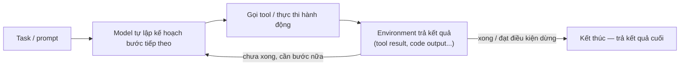

# AI Agent là gì — so với gọi LLM trực tiếp và so với RAG

**TL;DR**:
- **LLM call đơn**: 1 input → model xử lý 1 lượt → 1 output text, hết việc.
- **RAG (cổ điển)**: LLM được bổ sung bước tra cứu tài liệu ngoài, nhưng chỉ **một lần** (retrieve 1 lần → generate 1 lần) rồi kết thúc.
- **AI Agent**: LLM chạy trong **một vòng lặp** (agentic loop) — chính model, không phải code cố định, tự quyết định bước tiếp theo, tự gọi tool, tự đọc kết quả, tự lặp lại tới khi xong việc (confidence: high).

> **Thuật ngữ cần biết trước** (đọc trước khi vào chi tiết):
> - **Augmented LLM** = LLM "bản nâng cấp" được gắn thêm khả năng tra cứu (retrieval), gọi công cụ (tools), và nhớ lại hội thoại trước (memory) — vẫn trả lời trong 1 lượt, chỉ là "biết nhiều thứ hơn" LLM trần.
> - **Harness** = lớp code bao quanh model (VD Claude Code) — cấp tool, quản lý context, điều phối vòng lặp. Tự thân model chỉ sinh ra text; không có harness thì nó không "làm" được gì cả.
> - **Agentic loop** = chu trình lặp "model quyết định bước tiếp theo → gọi tool → đọc kết quả → quyết định tiếp" cho tới khi xong việc — cơ chế chi tiết ở mục 4.
> - **ReAct** = kiến trúc/pattern phổ biến để hiện thực agentic loop, xen kẽ 3 bước Thought (suy luận) → Action (gọi tool) → Observation (đọc kết quả) — chi tiết + ví dụ ở mục 7.
> - **SWE-bench** = một bộ benchmark đánh giá coding agent bằng cách cho agent tự sửa bug thật trong các repo GitHub lớn — dùng làm ví dụ "task đủ phức tạp cần agent" ở mục 6.
> - **Subagent** = một agent con được agent cha (VD Claude Code) gọi ra để làm 1 việc con, chạy trong context riêng biệt — không thấy lịch sử hội thoại của cha, chỉ trả kết quả cuối về — chi tiết ở mục "Áp dụng với Claude Code".
> - **Context window compact** = khi lịch sử hội thoại + tool output gần đầy context window, harness tự động tóm tắt bớt phần cũ để nhường chỗ, thay vì dừng hẳn — chi tiết ở mục "Áp dụng với Claude Code".

## 0. Ví dụ tối giản (đọc trước khi vào lý thuyết)

Task: "Sửa lỗi 1 test đang fail trong repo."

- **LLM call đơn**: dán code + log lỗi vào prompt 1 lần → model đoán 1 bản sửa → xong, không biết đúng hay sai vì không tự chạy lại test.
- **RAG**: retrieve thêm code/docs liên quan trước khi generate → gợi ý sửa có ngữ cảnh tốt hơn, nhưng vẫn không tự kiểm tra kết quả.
- **AI Agent**: model tự đọc file test, tự chạy test để thấy lỗi, tự sửa code, tự chạy lại test để xác nhận — lặp lại với hướng khác nếu vẫn fail. Ví dụ đầy đủ (kèm tool cụ thể) ở mục 6.

## 1. Gọi LLM trực tiếp (single LLM call)

- Input → model xử lý trong 1 lượt (hoặc 1 lượt tool-use round-trip) → output text. Không có bước "quan sát môi trường rồi quyết định tiếp" nào cả.
- Nếu có tool-use, đó vẫn chỉ là **một "contract"**: app định nghĩa schema tool, model quyết định gọi hay không, kết quả trả về (`tool_result`) được đọc và model trả lời — kết thúc ở đó, không tự lặp thêm (as of platform.claude.com, confidence: high).
- Đây là "đơn vị nguyên tử" (atomic unit): khi lặp lại nhiều lần đơn vị này (gọi tool → đọc kết quả → gọi tool tiếp), nó biến thành một **agentic loop** — chính là ranh giới giữa "gọi LLM" và "agent" (confidence: medium).

## 2. RAG — mở rộng LLM bằng tra cứu, nhưng vẫn 1 lượt

Nói đơn giản: RAG = **model sinh câu trả lời** (generator, chính là LLM) + **kho tài liệu tra cứu ngoài** (index vector chứa các đoạn tài liệu) — trước khi trả lời, hệ thống tìm top-k đoạn tài liệu liên quan nhất, rồi đưa vào prompt cho model generate dựa trên đó.

(Với ai muốn tra thuật ngữ hàn lâm: paper gốc RAG (Lewis et al. 2020) gọi 2 phần này là "seq2seq generator" (parametric memory — kiến thức nằm sẵn trong trọng số model) và "non-parametric memory" (kiến thức nằm ngoài, trong index vector, tra cứu được, không cần train lại) (as of arxiv.org/abs/2005.11401, confidence: high).) Xem chi tiết pipeline 4 bước ở [[llm-rag-basics]].

Điểm mấu chốt để so sánh với agent: RAG **truyền thống (naive/classic)** là một pipeline **single-pass, cố định**: retrieve 1 lần → generate 1 lần. Bản thân RAG không tự quyết định có cần retrieve lại, viết lại câu hỏi, hay đánh giá bằng chứng đã đủ chưa.

- **Agentic RAG** = agent với tool + vòng lặp quyết định, driving retrieval: có thể reformulate query, retrieve nhiều vòng, chọn nguồn, tự đánh giá bằng chứng đủ hay chưa, lặp Retrieve → Reason → Decide tới khi đạt điều kiện dừng.
- Song song với phân biệt workflow-vs-agent ở mục 3: RAG cổ điển = workflow (đường đi cố định), agentic RAG = agent (tự định hướng retrieval của chính nó).
- Nguồn: arxiv.org/abs/2005.11401, towardsdatascience.com, nutrient.io, machinelearningmastery.com (confidence: medium — riêng thuật ngữ "agentic RAG" chưa có paper gốc chuẩn hoá, xem ghi chú ở mục "Giới hạn/open questions").

## 3. Định nghĩa Agent theo Anthropic — workflow vs agent

Anthropic phân 2 loại hệ thống agentic:

- **Workflow** — "hệ thống nơi LLM và tool được orchestrate qua các code path định sẵn (predefined)".
- **Agent** — "hệ thống nơi LLM tự định hướng (dynamically direct) quá trình và việc dùng tool của chính nó, giữ quyền kiểm soát cách hoàn thành task".

Yếu tố phân biệt cốt lõi: **mức độ tự chủ (autonomy)**, không phải năng lực thô. Workflow chạy trên "đường ray" định sẵn; agent tự quyết định các bước của chính nó. (Bảng so sánh đầy đủ 3 mô hình — LLM call / RAG / Agent — ở mục 5.)

Ba tính chất thiết yếu của hệ thống agentic:

1. **Tool integration** — tự chọn dùng tool nào, khi nào.
2. **Environmental feedback** — agent phải tự kiểm tra kết quả sau mỗi bước (test có pass không, code có chạy được không, tool trả về gì) để biết đã đi đúng hướng chưa, chứ không đoán mù. Đây là bước hoàn toàn không tồn tại trong 1 lần gọi LLM đơn thuần.
3. **Autonomy có guardrail** — hoạt động độc lập nhưng vẫn cho phép checkpoint/can thiệp của con người khi bị chặn.

Building block nền tảng theo Anthropic là **"augmented LLM"** (xem định nghĩa ở box thuật ngữ đầu bài) — cả workflow lẫn agent đều được xây bằng cách compose augmented LLM theo cách khác nhau. Nói cách khác: RAG (retrieval) chỉ là **một** dạng augmentation, không phải một phạm trù tách biệt khỏi agent.

Nguồn: anthropic.com/engineering/building-effective-agents (confidence: high).

## 4. Vòng lặp agent (agentic loop) — cơ chế cụ thể



Theo Claude Code / Agent SDK docs, vòng lặp này cụ thể là (as of code.claude.com, confidence: high):

1. Nhận prompt.
2. Model đánh giá: trả lời bằng text luôn, hay yêu cầu gọi tool.
3. Nếu yêu cầu tool → code bên ngoài (SDK/harness) thực thi tool, đưa kết quả trả về cho model (`tool_result`).
4. Lặp lại bước 2–3 tới khi model trả lời mà **không** yêu cầu tool nào nữa.
5. Trả kết quả cuối.

Một **"turn"** = một vòng round-trip của chu trình này. Task đơn giản có thể chỉ 1–2 turn; task phức tạp (VD "refactor module auth và update test") có thể chain hàng chục tool call qua nhiều turn (as of code.claude.com/agent-sdk/agent-loop, confidence: high). Đây chính là điểm khác cơ học so với "gọi LLM trực tiếp": không có vòng `while` nào cả — chỉ có đúng 1 request/response (hoặc tối đa 1 tool round-trip).

**Điều kiện dừng (stop condition)** không phải lúc nào cũng là "model tự quyết xong việc" — còn có: đạt ngưỡng confidence, chạm max iterations/turn, hết budget token/tiền, hoặc con người can thiệp dừng (as of anthropic.com, confidence: high).

## 5. So sánh 3 mô hình

| | LLM call đơn | RAG (cổ điển) | AI Agent |
|---|---|---|---|
| Số lượt xử lý | 1 lượt (input → output) | 1 lượt retrieve + 1 lượt generate (cố định) | N lượt, N do **model tự quyết** |
| Ai quyết định bước tiếp theo | Không có "bước tiếp theo" | Code cố định (pipeline định sẵn) | Chính model, dựa trên feedback từ môi trường |
| Có environmental feedback không | Không (trừ 1 tool round-trip nếu có) | Không (retrieve 1 lần, không tự đánh giá lại) | Có — cốt lõi của agent loop |
| Có tự sửa lỗi/lặp lại khi sai không | Không | Không (naive RAG) | Có — có thể retry, đổi chiến lược |
| Ví dụ | Hỏi 1 câu, model trả lời thẳng | Chatbot hỏi-đáp tài liệu nội bộ, retrieve 1 lần | Coding agent tự sửa lỗi, đọc log, edit nhiều file (VD Claude Code) |

## 6. Ví dụ cụ thể minh hoạ

Task: "Sửa lỗi test đang fail trong repo."

- **LLM call đơn**: dán nội dung file + log lỗi vào prompt 1 lần, model gợi ý 1 đoạn code sửa — không biết sửa có đúng không, không tự chạy lại test.
- **RAG**: retrieve thêm đoạn code/docs liên quan trong repo (semantic search) để model có ngữ cảnh, rồi generate gợi ý sửa — vẫn chỉ 1 lượt, không tự verify.
- **AI Agent** (VD Claude Code — xem mục 7): model tự đọc file test bằng tool Read, tự chạy Bash để reproduce lỗi, tự Edit code, tự chạy lại test (Bash) để quan sát kết quả (environmental feedback), nếu vẫn fail thì tự lặp lại với hướng sửa khác — tới khi test pass hoặc chạm giới hạn turn.

Ví dụ production khác theo Anthropic (as of anthropic.com, confidence: high): coding agent giải task kiểu SWE-bench (sửa nhiều file), computer-use agent điều khiển GUI, customer-support agent tra dữ liệu — xử lý hoàn tiền — cập nhật ticket qua nhiều lượt hội thoại.

## 7. Kiến trúc agent phổ biến: ReAct

Pattern nền tảng cho phần lớn agent hiện nay là **ReAct** (Yao et al. 2022) — interleave (xen kẽ) giữa 3 bước lặp đi lặp lại:

1. **Thought** — model tự suy luận thành lời: "mình cần làm gì tiếp theo?"
2. **Action** — model gọi 1 tool cụ thể dựa trên Thought vừa rồi.
3. **Observation** — model đọc kết quả thật trả về từ tool, dùng nó làm input cho Thought kế tiếp.

Điểm khác biệt so với chain-of-thought thuần (model tự suy luận nhiều bước nhưng không hành động): mỗi Thought trong ReAct đều được "ground" (neo/đối chiếu) vào một Observation **thật** từ môi trường, chứ không suy luận nội tại một mạch từ đầu đến cuối rồi mới trả lời.

Ví dụ minh hoạ cho task "sửa lỗi test fail" (tiếp nối mục 0, 6):

```
Thought:     Cần xem test nào đang fail và lỗi cụ thể là gì.
Action:      Bash("npm test")
Observation: "FAIL: test_login — expected 200, got 401 tại dòng 42"

Thought:     Lỗi 401 nghĩa là auth token có thể sai. Cần đọc code liên quan.
Action:      Read("src/auth/login.ts")
Observation: (nội dung file — thấy hàm generateToken() thiếu param `expiresIn`)

Thought:     Đã rõ nguyên nhân. Sửa hàm generateToken() rồi chạy lại test.
Action:      Edit("src/auth/login.ts", ...)
Observation: (file đã sửa)

Thought:     Cần xác nhận fix có đúng không.
Action:      Bash("npm test")
Observation: "PASS: test_login" → đạt điều kiện dừng, kết thúc vòng lặp.
```

Đây chính là mục 4 (agentic loop) được hiện thực hoá theo 1 pattern cụ thể, có tên gọi rõ ràng cho từng bước (as of react-lm.github.io, arxiv.org/abs/2210.03629, confidence: high). Đây là kiến trúc chuẩn dùng trong Claude Code, Cursor, và các framework như LangChain/LangGraph. Xem thêm liên hệ reasoning model ở [[llm-reasoning-vs-standard-models]] mục "Liên hệ agent architecture: ReAct".

## 8. Khi nào KHÔNG cần Agent

Anthropic khuyến nghị rõ: bắt đầu từ giải pháp đơn giản nhất, chỉ thêm agent khi thật sự cần. Không nên dùng agent khi:

- Một lần gọi LLM + retrieval (RAG) đơn giản là đủ.
- Latency/chi phí của vòng lặp nhiều turn không đáng so với lợi ích (mỗi turn thêm cost + risk lỗi lan truyền từ bước trước).
- Cần **predictability/consistency** cao hơn là **flexibility** — task có số bước cố định, dự đoán trước được thì dùng workflow, không cần agent.
- Không thể cung cấp môi trường sandbox có guardrail an toàn cho agent hoạt động tự chủ.

Agent phù hợp nhất cho **bài toán mở** — nơi không thể dự đoán trước số bước cần thiết (as of anthropic.com, confidence: high).

### Decision checklist khi review PR đề xuất "dùng agent thay vì workflow"

- Số bước xử lý có biết trước và cố định không? → **Biết trước** → dùng workflow (code path định sẵn), không cần agent. → **Không biết trước / thay đổi tuỳ input** → cân nhắc agent.
- Task có cần p99 latency thấp, ổn định (VD API endpoint sync, người dùng chờ trực tiếp)? → **Có** → workflow hoặc 1 LLM call, tránh agent loop nhiều turn. → **Không** (batch job, async, có thể chạy nền vài chục giây–vài phút) → agent chấp nhận được.
- Có cần audit/test hành vi dự đoán được (so sánh input → output cố định) không? → **Có** → workflow dễ test/observability hơn nhiều (assert từng bước cố định). → **Không**, chấp nhận output biến thiên theo tình huống → agent phù hợp hơn.
- Có sẵn sandbox/guardrail an toàn (quyền hạn tool giới hạn, có thể rollback) cho agent tự hành động không? → **Không** → đừng dùng agent tự chủ cao, giữ workflow hoặc agent với permission mode chặt (xem mục dưới).

### Ước lượng thô về chi phí/latency (order-of-magnitude, chưa benchmark chính thức)

- 1 LLM call đơn: 1 request, latency thường vài giây, chi phí = 1 lần input+output token.
- 1 agent loop 5–15 turn (coding task trung bình): tổng token tiêu thụ ước tính **~5–20x** so với 1 LLM call đơn (mỗi turn có thể re-gửi lại context tool trước đó), latency cộng dồn từ vài chục giây tới vài phút.
- Hệ quả thực tế: nếu định thay 1 API endpoint đơn giản (validate input → query DB → trả response) bằng 1 agent tự do đọc/ghi, chi phí và latency có thể tăng 1-2 bậc độ lớn mà không tăng tương ứng về chất lượng — đây là dấu hiệu nên quay lại workflow.
- Con số trên là ước lượng định tính từ quan sát thực tế triển khai, **chưa có benchmark định lượng chính thức** trong note này (xem mục Giới hạn/open questions).

## Liên hệ tới các phần khác

- [[llm-large-language-model]] — nền tảng: agent vẫn là LLM, chỉ khác ở cách được "đóng khung" (harness) xung quanh.
- [[llm-rag-basics]] — RAG là 1 dạng augmentation (retrieval) có thể đứng độc lập (single-pass) hoặc trở thành 1 tool bên trong agent loop (agentic RAG).
- [[llm-reasoning-vs-standard-models]] — mục ReAct: liên hệ giữa reasoning model (suy luận sâu nội tại) và agent loop (suy luận + hành động xen kẽ, có thể kết hợp).
- [[agentic-systems-taxonomy]] — phân loại chi tiết hơn các kiến trúc agent (khi note đó được viết đầy đủ).

### Áp dụng với Claude Code

Claude Code là ví dụ trực tiếp, cụ thể của khái niệm này — không phải "khó áp dụng" mà chính là **hiện thân** của agent loop (as of code.claude.com/docs/how-claude-code-works, confidence: high):

- Claude Code được mô tả là một **"agentic harness"** quanh model Claude: harness cấp tool, context management, và execution environment biến 1 model text thuần thành coding agent có năng lực hành động.
- Vòng lặp thực tế của Claude Code (agent-sdk/agent-loop): 3 pha lặp lại — **gather context** (Read/Glob/Grep/WebFetch), **take action** (Edit/Write/Bash), **verify results** (chạy lại test/build, đọc output) — cho tới khi task hoàn tất. Đây khớp chính xác với mục 4 ở trên.
- **Agent SDK** phân biệt rõ ràng: "Client SDK" = tự implement tool loop khi gọi API trực tiếp (giống mục 1 — LLM call); "Agent SDK" = build agent **mà không cần tự viết vòng lặp tool** — SDK đã chạy sẵn agentic loop cho bạn.
- Subagent trong Claude Code nhận **context window hoàn toàn cô lập/mới** (không kế thừa lịch sử hội thoại cha) — chỉ response cuối cùng trả về cha dưới dạng tool result — khác hẳn RAG (thường nhét tài liệu retrieve vào cùng 1 context chia sẻ).
- Context window của Claude Code tích luỹ system prompt, tool definitions, lịch sử hội thoại, tool input/output, CLAUDE.md, skill descriptions — và tự động **compact** (tóm tắt phần cũ) khi gần đầy — một dạng quản lý memory động vượt xa RAG one-shot.
- **Permission modes** (`default`, `acceptEdits`, `plan`, `dontAsk`, `auto`, `bypassPermissions`) là lớp governance kiểm soát tool call có tự chạy hay cần người duyệt — chính là "autonomy with guardrails" (mục 3) hiện thực hoá bằng config cụ thể, thứ hoàn toàn không tồn tại khi chỉ gọi LLM API trực tiếp.

Ví dụ config tối thiểu dùng Agent SDK (TypeScript) để giới hạn agent loop — set số turn tối đa và permission mode, tương ứng trực tiếp với checklist ở mục 8:

```ts
import { query } from "@anthropic-ai/claude-agent-sdk";

const result = query({
  prompt: "Sửa lỗi test đang fail trong repo",
  options: {
    maxTurns: 15,              // chặn dừng vòng lặp — tránh chi phí leo thang không kiểm soát
    permissionMode: "acceptEdits", // agent tự Edit/Write, nhưng vẫn hỏi trước lệnh nguy hiểm
    allowedTools: ["Read", "Edit", "Bash", "Grep"], // giới hạn phạm vi hành động (sandbox mềm)
  },
});
```

`maxTurns` chính là "chạm max iterations/turn" ở mục 4 (stop condition); `permissionMode` + `allowedTools` chính là guardrail ở mục 3 (tính chất #3) — cả hai đều là đòn bẩy cụ thể để trả lời câu hỏi "tốn thêm bao nhiêu, kiểm soát thế nào" khi review PR đề xuất dùng agent (as of code.claude.com/agent-sdk/overview, confidence: high).

## Giới hạn / open questions

- Thuật ngữ **"agentic RAG"** (mục 2) đến từ nguồn thứ cấp (blog/practitioner), chưa có paper gốc chuẩn hoá định nghĩa — confidence thấp, cần note riêng khi có nguồn gốc mạnh hơn.
- Chưa cover chi tiết cách **multi-agent pattern** (planner/generator/evaluator) hoạt động trong thực tế — chỉ mới nhắc tên, để dành cho note riêng trong nhóm Agent Architectures.
- Số liệu "5–20x token, vài chục giây–vài phút" ở mục 8 là **ước lượng thô, chưa benchmark định lượng chính thức** (chưa có đo đạc thật trên tập task cụ thể, chưa tách theo model/task type) — dùng để tham khảo order-of-magnitude, không dùng làm số liệu chính xác trong quyết định kỹ thuật quan trọng.
- Ranh giới giữa "workflow phức tạp" và "agent đơn giản" đôi khi mờ trong thực tế triển khai — bản thân Anthropic cũng thừa nhận đây là dải liên tục (spectrum) chứ không phải nhị phân tuyệt đối.
- Chưa cover **memory dài hạn** (persistent memory qua nhiều session) như một thành phần của agent — mới chỉ nói tới memory trong 1 session (context window).
