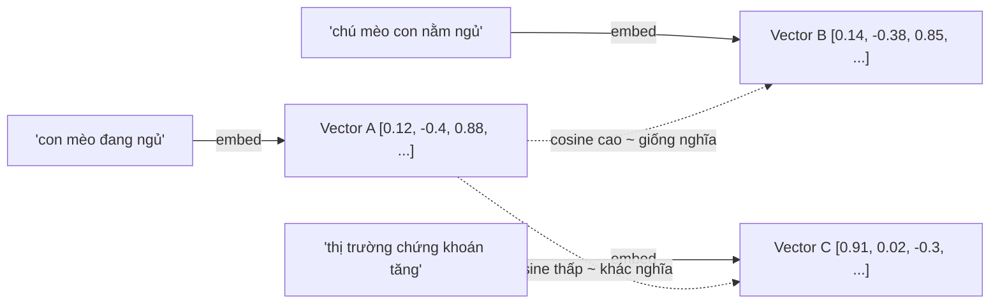
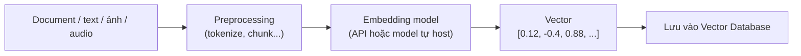
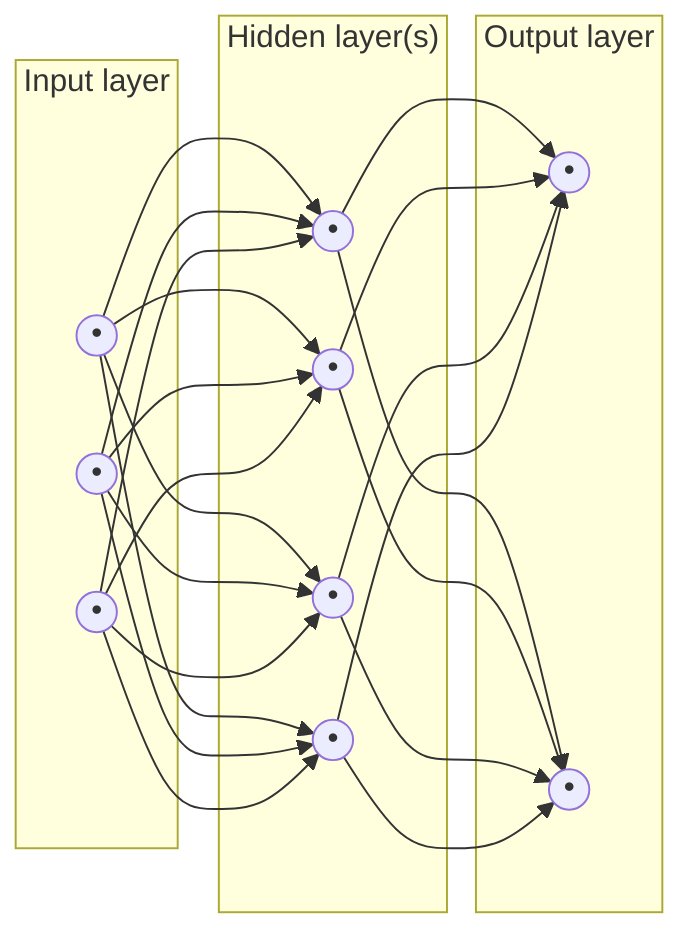
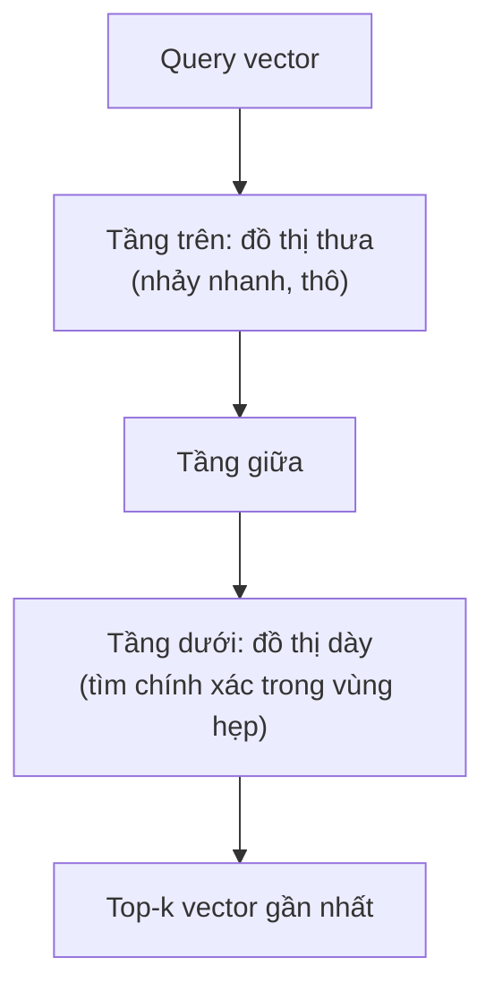

# Embedding

Embedding là một **vector số thực** đại diện cho ý nghĩa (semantic meaning) của một object — text, ảnh, audio... — được một ML model tạo ra sao cho object có ý nghĩa càng giống nhau thì vector càng "gần" nhau trong không gian nhiều chiều (confidence: high). Nhờ vậy, thay vì so khớp chuỗi ký tự (keyword match), máy có thể tìm kiếm/so sánh object theo **semantic search** — "gần nghĩa" chứ không cần trùng từ.

Ba tính chất cốt lõi cần nhớ:
- Embedding **nén** object phức tạp (câu văn, ảnh...) thành một mảng số có chiều cố định — chuyển object sang dạng máy tính "tính toán" được (khoảng cách, phép cộng/trừ vector...).
- Embedding **capture ý nghĩa**, không phải capture chuỗi ký tự gốc — hai câu diễn đạt khác nhau nhưng cùng ý sẽ có embedding gần nhau.
- Embedding được **học** (learned), không phải rule tay — do một neural network sinh ra sau khi train trên dữ liệu lớn, nên chất lượng phụ thuộc hoàn toàn vào model/data dùng để train.

## Vector trong Embedding

Một vector là một mảng số định nghĩa một điểm trong không gian nhiều chiều (dimensional space).

> Ví dụ vector 4 chiều: `[1989, 22, 9, 180]` — 4 con số = 4 "trục" (dimension).

Trong thực tế, embedding vector có số chiều lớn hơn nhiều — ví dụ GPT-2 dùng 768 chiều, OpenAI `text-embedding-3-large` mặc định 3072 chiều (có thể cắt xuống 256 nhờ kỹ thuật Matryoshka mà chất lượng giảm không đáng kể) (as of 2026, reintech.io) (confidence: medium — số chiều cụ thể thay đổi theo từng model/version).

### Đo độ "gần" giữa hai vector — similarity metrics
Hai object tương tự nhau ⇔ hai vector của chúng "gần" nhau. Có 3 cách đo phổ biến:

| Metric | Đo gì | Khi nào dùng |
|---|---|---|
| **Cosine similarity** | Góc giữa 2 vector (bỏ qua độ dài/magnitude), giá trị từ -1 đến 1 — càng gần 1 càng giống nhau | Phổ biến nhất cho text embedding, vì hướng vector mang ý nghĩa hơn độ dài |
| **Dot product** | Tích vô hướng — vừa phụ thuộc góc vừa phụ thuộc độ dài vector | Khi model được train tối ưu sẵn cho dot product (một số embedding model chuẩn hoá sẵn để dot product = cosine) |
| **Euclidean distance (L2)** | Khoảng cách đường thẳng giữa 2 điểm trong không gian | Ít dùng cho text, phổ biến hơn ở các bài toán clustering số liệu thường |

(as of pinecone.io "Vector Similarity Explained") (confidence: high)

## Embedding process — quy trình tạo embedding

Quy trình tổng quát: **Document → Embedding model/API → Vector**

Đây là một quá trình dùng **Deep Learning**: object đầu vào được đưa qua một neural network đã train sẵn, và output là vector — không cần biết bên trong model làm gì, chỉ cần gọi API/model và nhận về vector.

## Neural network tạo ra embedding như thế nào?

Neural network là một model Deep Learning mô phỏng (một cách đơn giản hoá) cấu trúc não người — gồm nhiều "node" ảo (neuron) xếp thành các layer, kết nối với nhau bằng trọng số (weight) học được qua training.

- **Input layer** — nhận object đầu vào đã qua preprocessing (VD: token IDs của câu text).
- **Hidden layer** — nơi network học các representation trung gian; **embedding chính là giá trị (activation) lấy ra từ một hidden layer cụ thể** — thường là layer cuối trước output, hoặc một "pooled" representation gộp toàn bộ sequence (mean pooling / [CLS] token tuỳ kiến trúc). Đây là điểm nhiều người nhầm: embedding không phải là "output" theo nghĩa classification, mà là **representation nội bộ** được lấy ra và dùng làm vector.
- **Output layer** — với model train riêng để sinh embedding (embedding model), output layer thường đã bị bỏ đi/không dùng tới; ta chỉ lấy hidden state làm sản phẩm cuối.

> Liên hệ [[llm-large-language-model]]: trong Transformer, mỗi token đã có một embedding riêng ngay từ input (token embedding + positional encoding), sau đó qua nhiều layer self-attention thì các embedding này liên tục được "làm giàu" thêm ngữ cảnh — token embedding ở layer cuối cùng đã mang nghĩa theo ngữ cảnh câu (contextual embedding), khác hẳn embedding tĩnh kiểu Word2Vec/GloVe (mỗi từ chỉ có đúng 1 vector cố định, không đổi theo câu).

## Embedding với LLM

- **Token embedding** — bước đầu tiên trong Transformer: mỗi token được tra trong một bảng lookup (embedding matrix) ra vector khởi tạo, trước khi cộng thêm positional encoding rồi đưa vào các layer attention.
- **Contextual/document embedding** — khi dùng cho semantic search/RAG, người ta thường lấy embedding ở mức câu/đoạn/tài liệu (không phải từng token) bằng cách pooling các token embedding cuối cùng — context của cả đoạn văn/bài báo được nén vào 1 vector, cho phép lưu và search sau này.
- Đây chính là cơ chế nền cho **RAG (Retrieval-Augmented Generation)**: tài liệu được embed và lưu vào vector database; khi có câu hỏi, câu hỏi cũng được embed, rồi tìm các đoạn tài liệu có vector gần nhất để đưa vào context cho LLM trả lời (xem nhóm `rag-` trong [[ai-engineer-roadmap]]).

## Vector database & tìm kiếm gần đúng (ANN search)

Khi có hàng triệu/tỷ vector, so sánh tuần tự (brute-force) với từng vector là quá chậm. Vector database dùng thuật toán **ANN (Approximate Nearest Neighbor)** — đánh đổi một chút độ chính xác (recall) để lấy tốc độ nhanh hơn gấp hàng trăm lần (as of pingcap.com) (confidence: high).

- **HNSW (Hierarchical Navigable Small World)** — thuật toán ANN phổ biến nhất hiện nay: tổ chức vector thành đồ thị nhiều tầng (layer), tầng trên là các "đường tắt" thô để nhảy nhanh qua không gian rộng, tầng dưới tìm chính xác hơn ở phạm vi hẹp. Trade-off: recall/độ chính xác cao nhưng tốn RAM hơn các phương pháp khác (as of zilliz.com) (confidence: high).
- Các phương pháp ANN khác: **IVF** (Inverted File Index — chia không gian thành cluster, chỉ search trong cluster gần nhất), **PQ** (Product Quantization — nén vector để tiết kiệm bộ nhớ, đánh đổi độ chính xác).

## Một số embedding model phổ biến (2026)

| Model | Nhà cung cấp | Số chiều mặc định | Ghi chú |
|---|---|---|---|
| `text-embedding-3-large` | OpenAI | 3072 (cắt được xuống 256 qua Matryoshka) | Context tới 8,191 token |
| `voyage-3.5` / `voyage-4-large` | Voyage AI | tuỳ model | voyage-4-large dùng kiến trúc MoE cho embedding; có bản chuyên biệt cho code/legal/finance |
| `embed-v4` | Cohere | tuỳ model | Có bản multilingual, bản "light" giá rẻ hơn |
| `BGE-M3` | BAAI (open-source) | tuỳ config | Tự host được, context tới 8,192 token |

(as of 2026, reintech.io "Embedding Models Comparison 2026") (confidence: medium — bảng giá/số liệu thay đổi nhanh, cần re-check khi triển khai thực tế thay vì tin tuyệt đối vào note này)

## Use case chính

- **Semantic search** — tìm tài liệu theo nghĩa thay vì khớp từ khoá.
- **RAG** — retrieval trước khi generate, xem [[llm-large-language-model]] mục Giới hạn (khắc phục knowledge cutoff/context window).
- **Recommendation** — tìm item "giống" item người dùng đã thích dựa trên khoảng cách vector.
- **Clustering / deduplication** — nhóm các object giống nhau, phát hiện trùng lặp gần đúng (near-duplicate) mà không cần khớp chuỗi tuyệt đối.
- **Anomaly detection** — object có vector "lạc" xa các cụm còn lại có thể là bất thường.

## Giới hạn / open questions
- Embedding tĩnh (Word2Vec/GloVe) vs contextual embedding (từ Transformer) — nên tách note riêng nếu cần so sánh sâu lịch sử phát triển.
- Chunking strategy (chia tài liệu thành đoạn bao lớn trước khi embed) ảnh hưởng mạnh tới chất lượng RAG — để dành cho note `rag-chunking-strategies` (đã có trong roadmap, `planned`).
- Chưa cover **fine-tune embedding model** cho domain riêng (VD: embedding cho code, cho tiếng Việt chuyên ngành) — để lại cho note `finetune-` nếu cần đào sâu.
- Chưa so sánh chi tiết IVF vs HNSW vs PQ về chi phí/độ chính xác thực tế — cần benchmark riêng khi chọn vector DB cho production.
