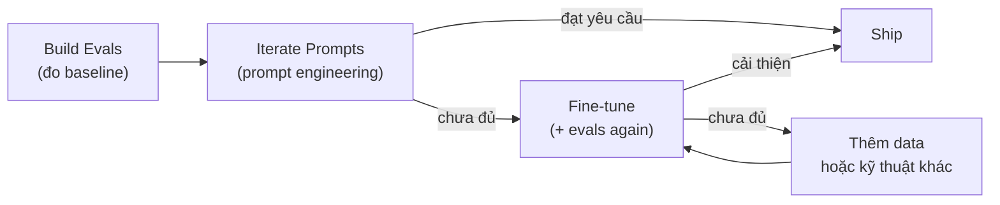

# Fine-tuning LLM

Fine-tuning là quá trình **tiếp tục train một model đã pretrain** trên một tập dataset nhỏ hơn, đặc thù cho task/domain cụ thể — nhằm điều chỉnh hành vi model mà không cần train từ đầu (confidence: high). Kết quả là trọng số model thay đổi, khác với [[prompt-engineering]] chỉ thay đổi input text.

Fine-tuning không chỉ là bước cuối — OpenAI khuyến nghị nó là **một bước trong vòng lặp optimization**, đứng sau prompt engineering và evaluation (xem quy trình ở mục dưới).

> Liên hệ [[llm-large-language-model]] mục "Training pipeline": SFT ở bước 2 của pipeline pretraining → SFT → RLHF chính là fine-tuning trong nội bộ lab. Fine-tuning dành cho developer/researcher là bước thứ 4 — bắt đầu từ model đã qua pipeline đó.

## Khi nào nên dùng fine-tuning?

Fine-tuning phù hợp khi:

- **Format / style output cố định** không đạt được ổn định qua prompt — VD: luôn trả về JSON với schema đặc thù, giọng viết nhất quán theo thương hiệu.
- **Prompt quá dài, tốn kém** — thay vì nhét 50 ví dụ vào mỗi request, encode kiến thức đó vào trọng số, rút ngắn prompt ở inference.
- **Dữ liệu proprietary** — không muốn gửi context nhạy cảm lên từng request (fine-tune offline, inference chỉ cần input ngắn).
- **Model nhỏ cần đạt hiệu năng cao trên task hẹp** — fine-tuned 7B có thể outperform GPT-4o trên task đặc thù với đủ data chất lượng.
- **Prompt engineering đã tối ưu nhưng vẫn chưa đủ** — đây là signal rõ nhất để chuyển sang fine-tune.

Ngược lại, **không nên fine-tune** khi:
- Chưa thử và tối ưu hết prompt engineering (tốn công vô ích).
- Không có dataset đủ chất lượng (garbage in → garbage out, dù fine-tuned).
- Task đa dạng thay đổi liên tục — fine-tune bị "lock" vào distribution data đã train.

## Quy trình tối ưu hoá (OpenAI recommended)



- **Eval đến trước** — không thể biết fine-tuning có hiệu quả hay không nếu chưa có benchmark đo performance.
- **Prompt trước, fine-tune sau** — nhiều trường hợp prompt engineering kết hợp few-shot đã đủ, tiết kiệm hoàn toàn chi phí training.

## Các phương pháp fine-tuning

### Supervised Fine-Tuning (SFT)

Train model trên tập **input → output đúng** do con người hoặc LLM mạnh hơn tạo ra. Objective vẫn là next-token prediction nhưng chỉ trên dữ liệu đặc thù. Đây là phương pháp cơ bản nhất, dùng cho:
- Instruction following (dạy model trả lời theo kiểu nhất định).
- Classification, extraction, translation.
- Sửa format output sai lặp đi lặp lại.

### Direct Preference Optimization (DPO)

Thay vì train reward model riêng rồi dùng RL như RLHF, DPO dùng trực tiếp **cặp output (chosen vs rejected)** để update trọng số. Model học phân biệt response tốt/xấu mà không cần vòng lặp RL phức tạp (confidence: high, Rafailov et al. 2023, arxiv 2305.14314). Phù hợp cho:
- Điều chỉnh tone, style, formality.
- Dạy model từ chối theo cách tự nhiên hơn.
- Safety alignment nhẹ.

### Reinforcement Fine-Tuning (RFT)

Áp dụng RL với **verifiable reward**: một grader/verifier chấm output model đúng/sai, tín hiệu đó dùng làm reward. Chỉ dùng được với **reasoning model** (model có extended thinking) và task có đáp án verify được — toán học, code, logic (confidence: high, OpenAI). Chi phí cao nhất trong 4 phương pháp.

### Parameter-Efficient Fine-Tuning (PEFT) — LoRA

Full fine-tuning cập nhật toàn bộ hàng tỷ trọng số — cực kỳ tốn GPU/memory. PEFT là nhóm kỹ thuật chỉ cập nhật **một phần nhỏ tham số**:

**LoRA (Low-Rank Adaptation)** — phương pháp PEFT phổ biến nhất (confidence: high, Hu et al. 2021, arxiv 2106.09685):
- Thay vì update trực tiếp weight matrix W, thêm 2 ma trận thứ hạng thấp A và B sao cho ΔW = A × B.
- Số tham số cần train giảm 10–10,000× tuỳ rank, trong khi hiệu năng giữ gần bằng full fine-tune trên nhiều task.
- Sau khi train, A × B có thể merge vào W gốc → không tăng latency lúc inference.

```
Full fine-tune: update W (d × d) → d² params
LoRA:           update A (d × r) + B (r × d) → 2dr params, với r << d
```

**QLoRA** — kết hợp LoRA với quantization (4-bit), giảm thêm memory → cho phép fine-tune model 70B trên GPU consumer (VD: RTX 4090 48GB).

**Prompt tuning** — dạng PEFT học soft prompt embeddings, không touch trọng số model. Xem chi tiết tại [[prompt-engineering]] mục so sánh.

## So sánh các kỹ thuật tối ưu

| | Prompt Engineering | Prompt Tuning | LoRA / PEFT | Full Fine-tuning |
|---|---|---|---|---|
| Thay đổi gì | Text input | Soft prompt vectors | Ma trận rank-thấp | Toàn bộ trọng số |
| Cần data | Không | Có (nhỏ) | Có | Có (nhiều hơn) |
| GPU cần | Không | Nhỏ | Vừa | Lớn |
| Latency inference | Không thay đổi | Không thay đổi | Không thay đổi (nếu merge) | Không thay đổi |
| Flexibility | Cao (đổi prompt tức thì) | Thấp (phải retrain) | Thấp | Thấp |
| Tốt nhất cho | Prototype, đa dạng task | 1 task cụ thể, tiết kiệm | Domain hẹp, tiết kiệm GPU | Hiệu năng tối đa, nhiều GPU |

## Dữ liệu cho fine-tuning

Chất lượng data quan trọng hơn số lượng (confidence: high):

- **Format chuẩn**: JSONL, mỗi dòng là 1 example với `messages` gồm system/user/assistant — theo format chat completion của từng provider.
- **Số lượng tối thiểu**: thường cần ít nhất 50–100 examples chất lượng cao để thấy khác biệt, 500–1000+ cho task phức tạp.
- **Tỷ lệ train/validation**: thường 90/10 hoặc 80/20 — validation set dùng để đánh giá overfitting.
- **Overfitting**: nếu train loss giảm nhưng validation loss tăng → model đang học thuộc data thay vì generalize → giảm epochs hoặc thêm data đa dạng.
- **Data leakage**: đảm bảo validation set không có ví dụ tương tự train set — không thì eval sẽ overestimate performance.

## Fine-tuning vs RAG

Hai kỹ thuật giải quyết vấn đề khác nhau, không loại trừ nhau (confidence: high):

| | Fine-tuning | RAG |
|---|---|---|
| Giải quyết vấn đề gì | Hành vi/style/format model | Thiếu kiến thức / dữ liệu mới |
| Knowledge cutoff | Không thay đổi (vẫn bị cutoff) | Cập nhật được liên tục |
| Data cần | Training data (tĩnh) | Knowledge base (có thể update) |
| Khi dùng | Dạy cách trả lời | Dạy biết gì để trả lời |
| Chi phí setup | Cao (training) | Trung bình (indexing + retrieval) |

Thực tế production: nhiều hệ thống dùng **cả hai** — RAG cung cấp context liên quan, fine-tuning dạy model xử lý context đó theo cách đúng format/style mong muốn.

## Giới hạn và rủi ro

- **Catastrophic forgetting** — fine-tune chuyên sâu có thể làm model quên kiến thức chung. PEFT/LoRA giảm thiểu vấn đề này so với full fine-tune.
- **Overfitting nhỏ** — dataset nhỏ dẫn tới model học thuộc ví dụ, không generalize — validation loss là tín hiệu chính để detect.
- **Data quality là bottleneck** — model học từ pattern trong data, nếu data sai hoặc nhất quán kém thì fine-tuning sẽ reinforce những pattern đó.
- **Không thay thế được alignment** — fine-tune trên task-specific data không làm model "safer" hay "more aligned" theo nghĩa RLHF — đừng dùng SFT thay cho safety training.
- **OpenAI đang wind down fine-tuning platform** (as of 2026): new user access đã đóng, existing users tiếp tục được dùng. Fine-tune tự host qua Hugging Face / Axolotl / LLaMA Factory vẫn là lựa chọn thay thế phổ biến (confidence: medium — cần verify trạng thái platform theo thời gian).

## Open questions / cần đọc thêm

- Chi tiết RLHF vs DPO về chi phí, ổn định training, và quality thực tế — có thể tách note riêng khi đào sâu alignment kỹ thuật.
- **Axolotl / LLaMA Factory** — tooling phổ biến để fine-tune model open-source (Llama, Mistral...) — chưa cover.
- Benchmark tự đo: fine-tuned small model (7B LoRA) vs GPT-4o few-shot trên task thực của project — cần thực nghiệm mới có số liệu đáng tin.
- **Continual fine-tuning** (fine-tune nhiều lần trên data mới theo thời gian) và chiến lược tránh catastrophic forgetting — chưa cover.
- Liên hệ [[llm-large-language-model]] mục RLHF: bước 3 của pipeline lab chính là fine-tuning ở quy mô lớn — khoảng cách giữa "fine-tune developer" và "RLHF lab" là về scale data, compute, và verifier quality.
