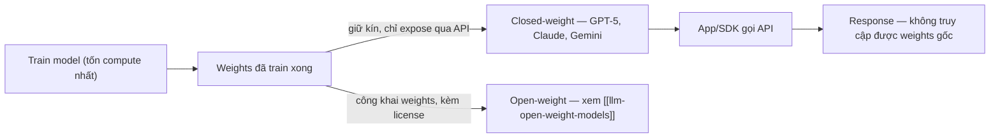

# Closed-weight models — API-only, không công khai trọng số

**Closed-weight model** là model AI mà **trọng số đã train (weights)** — tức các con số lưu lại những gì model đã học được — không được công khai cho công chúng. Người dùng chỉ gửi prompt tới model qua **online service hoặc SDK** (API), chứ không thể tải weights về, soi bên trong, hay tự fine-tune trên máy riêng. Công ty sở hữu model giữ toàn quyền kiểm soát và đặt luật chơi cho việc sử dụng, thường qua **API trả phí** hoặc **license siết chặt**. Cách này giúp chủ sở hữu bảo vệ bí mật công nghệ (trade secret), giảm rủi ro lạm dụng, và duy trì nguồn thu ổn định. Đánh đổi: người dùng ít tự do hơn, chi phí tăng dần theo thời gian sử dụng, và gần như không thể audit hay tuỳ biến sâu model. Các ví dụ nổi bật: **GPT-4/GPT-5** (OpenAI), **Claude** (Anthropic), **Gemini** (Google DeepMind).

So sánh với open-weight, xem thêm [[llm-open-weight-models]] — cùng một sơ đồ nhánh, nhưng closed-weight đi theo nhánh "giữ kín".

## Vì sao chọn closed-weight (qua API) thay vì tự host

- **Chất lượng đầu bảng (frontier)** — tính đến 2026-08, model closed-weight top-tier vẫn dẫn đầu hầu hết benchmark khó nhất; Stanford ghi nhận khoảng cách ~49 điểm Arena giữa closed-weight dẫn đầu và open-weight dẫn đầu tính tới tháng 3/2026, dù khoảng cách đang thu hẹp dần so với 2023-2024 (as of nextplatform.com, digitalapplied.com) (confidence: medium — số liệu benchmark thay đổi liên tục theo từng đợt release model mới).
- **Không cần tự lo hạ tầng GPU/MLOps** — provider tự lo serving, scaling, uptime; team chỉ cần gọi API, phù hợp khi không có đội infra chuyên trách.
- **Cập nhật liên tục, không cần tự retrain/redeploy** — provider tự nâng cấp model nền, người dùng API tự động hưởng lợi (nhưng cũng phải chấp nhận behavior model có thể đổi giữa các version mà mình không kiểm soát được).
- **Dedicated support & compliance** — vendor lớn (OpenAI, Anthropic, Google) thường có SLA, chứng nhận bảo mật (SOC 2...), hỗ trợ enterprise — giảm việc tự phải tự chứng minh compliance.
- **Đánh đổi chính:**
  - **Chi phí tăng theo scale** — trả theo token qua thời gian dài có thể đắt hơn tự host, đặc biệt ở khối lượng lớn (xem breakdown giá & điểm hoà vốn self-host trong [[llm-token-pricing]]). Theo khảo sát 05-09/2025, giá list API model open-weight rẻ hơn ~8 lần so với closed-weight (trung bình $0.23/1M token so với $1.86/1M token) (as of digitalapplied.com) (confidence: medium — giá list, chưa tính discount enterprise/volume).
  - **Dữ liệu rời khỏi hạ tầng của mình** — request phải gửi qua network tới server provider, không phù hợp với dữ liệu cực nhạy cảm nếu provider không có cam kết/hợp đồng đủ chặt (data residency, no-training-on-your-data...).
  - **Không tự fine-tune sâu được** — thường chỉ có tuỳ chọn giới hạn (fine-tuning API do provider cung cấp, nếu có) chứ không đụng trực tiếp vào weights như open-weight (xem [[llm-fine-tuning]]).
  - **Phụ thuộc vendor (lock-in)** — rate limit, pricing, chính sách sử dụng, hay cả việc deprecate model cũ đều do provider quyết định, không nằm trong tay người dùng.
  - **Khó audit/giải trình** — không soi được kiến trúc/training data, khó dùng trong domain đòi hỏi minh bạch cao (y tế, tài chính, compliance nghiêm ngặt) so với open-weight.

## Các provider closed-weight tiêu biểu

| Provider | Model family | Cách truy cập | Ghi chú |
|---|---|---|---|
| **OpenAI** | GPT-4, GPT-4.1, GPT-5 (và các bản mini/nano) | API (openai.com/api), ChatGPT | Model đại chúng, hệ sinh thái tool-calling/plugin rộng; giá chi tiết xem [[llm-token-pricing]] |
| **Anthropic** | Claude (Opus, Sonnet, Haiku — dòng "Claude 4/5" tính tới 2026) | API (claude.com), Claude Code, Claude Desktop | Chú trọng an toàn/alignment (Constitutional AI), context window dài, mạnh về coding/agentic use case |
| **Google DeepMind** | Gemini (Pro, Flash, Nano) | API (Google AI Studio, Vertex AI), tích hợp Google Workspace | Native multimodal (text/ảnh/audio/video), tích hợp sâu hệ sinh thái Google Cloud |

Cả ba đều theo mô hình license/điều khoản sử dụng riêng của từng công ty (Terms of Service + Usage Policy) — khác hoàn toàn cách các model open-weight công bố license file cụ thể (Apache 2.0, Llama Community License...) đi kèm mỗi checkpoint.

## Closed-weight vs open-weight — bảng đối chiếu nhanh

| | Closed-weight (GPT, Claude, Gemini) | Open-weight (Llama, Qwen, DeepSeek...) |
|---|---|---|
| Truy cập weights | ❌ không thể | ✅ tải về được |
| Cách dùng | Qua API/SDK trả phí | Tự host hoặc dùng API của bên thứ ba host lại |
| Fine-tune | Giới hạn (chỉ qua fine-tuning API nếu provider hỗ trợ) | Tự do, đụng trực tiếp weights (xem [[llm-fine-tuning]]) |
| Kiểm soát dữ liệu | Dữ liệu đi qua hạ tầng provider | Có thể giữ 100% on-premise |
| Chi phí | Trả theo token, tăng theo usage, không cần lo hạ tầng | Chi phí hạ tầng cố định (GPU) + effort tự vận hành |
| Chất lượng đầu bảng | Thường dẫn đầu benchmark khó nhất | Đang thu hẹp khoảng cách nhanh, có model xấp xỉ closed-weight ở nhiều benchmark |
| Minh bạch/audit | Không soi được bên trong | Cộng đồng audit được kiến trúc, dò bias |

Xem chi tiết phía open-weight tại [[llm-open-weight-models]].

## Giới hạn / open questions
- Chưa đào sâu **usage policy/ToS cụ thể** của từng provider (rate limit, data retention, khu vực bị hạn chế) — mỗi hãng một chính sách riêng và hay thay đổi, cần đọc trực tiếp trang chính thức trước khi build sản phẩm thật thay vì tin bảng tóm tắt ở đây.
- Chưa cover **fine-tuning API** (VD: OpenAI fine-tuning, distillation) — khác hẳn cơ chế fine-tune trên open-weight, cần note riêng nếu đào sâu.
- Số liệu benchmark/khoảng cách chất lượng giữa closed và open-weight (VD: 49 điểm Arena) thay đổi liên tục theo từng đợt release — số trong note này chỉ là snapshot 2026-03/08, không nên coi là cố định.
- Chưa cover **enterprise agreement** (data processing agreement, on-prem/VPC deployment của closed-weight model qua Azure/Vertex/AWS Bedrock) — mảng này khác hẳn API public thông thường.
