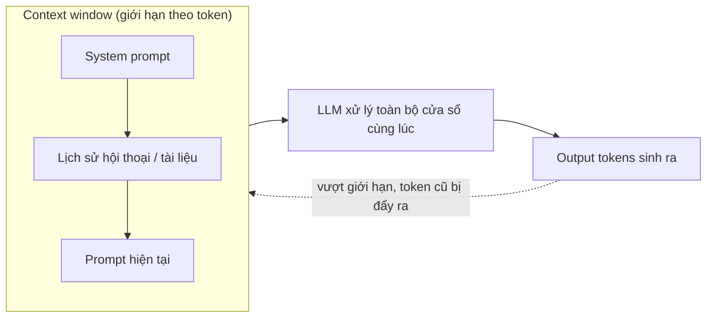

# Context window — "trí nhớ làm việc" của LLM trong một lần gọi

**Context window** là lượng văn bản (đo bằng **token**, xem [[llm-tokenization]]) mà một LLM có thể "nhìn thấy" cùng lúc trong một lần gọi — bao gồm cả **system prompt + lịch sử hội thoại + tài liệu đính kèm (input)** lẫn **phần model sẽ sinh ra (output)**, tuỳ định nghĩa của provider mà hai phần này tính chung một cửa sổ hay tách riêng giới hạn output tối đa (confidence: high). Đây không phải bộ nhớ dài hạn — nó chỉ tồn tại trong phạm vi một request, và khi hội thoại vượt quá kích thước cửa sổ, phần đầu (token cũ nhất) buộc phải bị cắt bỏ hoặc tóm tắt lại để nhường chỗ cho token mới — giống một **cửa sổ trượt (sliding window)** di chuyển dọc theo chuỗi token (as of ibm.com "Context Window") (confidence: high).

## Vì sao có giới hạn — không phải chỉ là con số tuỳ ý

Cơ chế **self-attention** trong Transformer (xem [[llm-large-language-model]]) tính quan hệ giữa **mọi cặp token** trong chuỗi — chi phí tính toán và bộ nhớ tăng theo bậc hai (quadratic) so với độ dài chuỗi ở kiến trúc attention gốc. Đây là lý do context window không thể "vô hạn miễn phí": cửa sổ càng dài, chi phí compute + latency cho mỗi lần gọi càng tăng nhanh, dù các kỹ thuật tối ưu (sparse attention, sliding window attention nội bộ model, KV-cache...) đã giúp các model 2026 đạt cửa sổ triệu-token khả dụng ở chi phí chấp nhận được so với vài năm trước.

## Kích thước context window các model phổ biến (as of 2026-08)

| Model | Context window | Ghi chú |
|---|---|---|
| Claude Opus 4.8 / Sonnet 5 / Fable 5 | 1,000,000 token | General availability ở giá chuẩn per-token, không còn là beta có gate riêng |
| Claude Haiku 4.5 | 200,000 token | Tier rẻ hơn, cửa sổ nhỏ hơn dòng cao cấp cùng nhà |
| GPT-5.4 / GPT-5.5 | 1,000,000 token | Max output riêng ~128,000 token |
| Gemini 2.5 Pro | 1,000,000 token (2,000,000 đang mở rộng) | |
| Gemini 3.1 Pro / 3.5 Flash | ~1,050,000 token | |

(as of morphllm.com "Claude Context Window Size 2026", digitalapplied.com "AI Context Window Comparison 2026") (confidence: medium — số liệu thay đổi nhanh theo từng đợt release, luôn kiểm tra lại docs chính thức của provider trước khi thiết kế hệ thống thật). Xu hướng chung: hầu hết model dẫn đầu benchmark năm 2026 hội tụ quanh mốc **~1 triệu token**, khác hẳn giai đoạn 2023-2024 khi 4K-128K token còn là chuẩn phổ biến.

## Cửa sổ lớn không đồng nghĩa dùng hiệu quả — hiện tượng "lost in the middle"

Một context window lớn **không đảm bảo model dùng tốt toàn bộ nội dung bên trong nó**. Benchmark kiểu **"needle in a haystack"** (giấu một thông tin quan trọng ở các vị trí khác nhau trong một tài liệu dài rồi kiểm tra model có tìm lại được không) cho thấy:

- Model có xu hướng đạt độ chính xác cao nhất khi thông tin quan trọng nằm ở **đầu hoặc cuối** context, và **giảm rõ rệt khi thông tin nằm ở giữa** — gọi là hiện tượng **"lost in the middle"**, biểu đồ độ chính xác theo vị trí có dạng chữ U.
- Hiệu năng có thể giảm **hơn 30%** khi thông tin quan trọng dịch từ đầu/cuối vào giữa cửa sổ; ở độ sâu vị trí 30-70% ghi nhận drop khoảng 5-15 điểm retrieval (as of arxiv 2503.00353 "U-NIAH", các benchmark needle-in-haystack liên quan) (confidence: medium — con số cụ thể phụ thuộc model và bộ benchmark, xu hướng chung thì nhất quán qua nhiều nghiên cứu).

→ Hệ quả thực hành: nhồi càng nhiều tài liệu vào context càng dài **không phải lúc nào cũng tốt hơn** RAG có chọn lọc — đây chính là lý do RAG vẫn quan trọng dù context window đã lên tới triệu token.

## Kỹ thuật mở rộng "context khả dụng" mà không chỉ dựa vào cửa sổ cứng của model

- **RAG (Retrieval-Augmented Generation)** — thay vì nhồi toàn bộ tài liệu vào prompt, hệ thống chỉ retrieve các đoạn liên quan nhất (qua vector search) rồi mới đưa vào context. RAG giúp giảm hẳn hiện tượng "lost in the middle" và cải thiện hiệu năng đáng kể, đặc biệt trên model nhỏ — có nghiên cứu ghi nhận RAG đạt tỷ lệ thắng ~82.58% so với nhồi context thô trên cùng benchmark (as of arxiv 2005.11401 gốc RAG paper, và các nghiên cứu RAG-vs-long-context sau này) (confidence: medium). Xem chi tiết retrieval ở [[llm-embedding]] và [[vector-search]].
- **Long-context transformer architecture** — các kỹ thuật kiến trúc (sparse/sliding-window attention nội bộ, RoPE scaling, KV-cache nén...) cho phép model xử lý chuỗi dài mà không tăng chi phí theo đúng tỷ lệ bậc hai thuần tuý — đây là lý do context window triệu-token khả thi về mặt chi phí ở 2026, khác hẳn nếu dùng attention gốc không tối ưu.
- **Context/prompt caching** — cache phần context lặp lại giữa nhiều lần gọi (system prompt, tài liệu tham chiếu cố định) để không phải trả phí input đầy đủ mỗi lần; liên hệ trực tiếp tới token-based pricing, xem [[llm-token-pricing]].
- **Summarization/compression** — tóm tắt lịch sử hội thoại cũ thành một đoạn ngắn hơn trước khi nó bị đẩy ra khỏi cửa sổ, giữ lại thông tin cốt lõi mà không tốn nguyên vẹn số token gốc — kỹ thuật phổ biến trong agent memory dài hạn (xem nhóm `agent-` trong [[ai-engineer-roadmap]]).

## Trade-off khi chọn kích thước context sử dụng thực tế

- **Chi phí** — hầu hết provider tính tiền theo đúng số token thực sự gửi vào, nên nhồi context lớn không cần thiết = tốn tiền không cần thiết, kể cả khi model "chịu được" cửa sổ đó (xem bảng giá ở [[llm-token-pricing]]); một số provider còn áp giá cao hơn cho request vượt một ngưỡng token nhất định.
- **Latency** — cửa sổ càng dài, thời gian xử lý (đặc biệt giai đoạn prefill trước khi bắt đầu sinh token đầu tiên) càng tăng — ảnh hưởng trực tiếp tới trải nghiệm real-time (liên hệ TTFT, xem [[llm-streamed-vs-unstreamed-responses]]).
- **Chất lượng** — như phần "lost in the middle" ở trên, context dài không tự động đồng nghĩa câu trả lời tốt hơn; cần cân nhắc retrieval có chọn lọc thay vì nhồi toàn bộ.

## Giới hạn / open questions
- Chưa benchmark cụ thể cho tiếng Việt về hiện tượng "lost in the middle" — phần lớn nghiên cứu needle-in-haystack hiện có đo trên tiếng Anh.
- Chưa đào sâu cơ chế kỹ thuật cụ thể bên trong (sparse attention, RoPE scaling...) giúp các model 2026 đạt cửa sổ triệu-token — mỗi lab có implementation riêng, ít công khai chi tiết, cần note riêng nếu tìm được nguồn đủ tin cậy.
- Số liệu context window trong bảng trên **thay đổi nhanh** theo từng đợt release model — luôn kiểm tra lại docs chính thức (anthropic.com, openai.com, ai.google.dev) trước khi thiết kế hệ thống dựa vào một con số cụ thể.
- Chưa cover cách tính "effective context" (khả năng dùng tốt) khác với "advertised context" (con số quảng cáo) — hai khái niệm này thường lệch nhau đáng kể theo benchmark thực tế.
