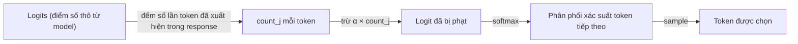

# Frequency Penalty — trừ điểm token theo số lần đã lặp lại trong response

**Frequency penalty** là một **generation control** trừ bớt logit của một token dựa trên **số lần token đó đã xuất hiện** trong phần response đang sinh ra — khác với [[llm-temperature]] (định hình lại toàn bộ phân phối) và [[llm-top-p]] (lọc tập ứng viên theo xác suất tích luỹ), frequency penalty **trừng phạt trực tiếp những token cụ thể đã bị dùng nhiều lần**, không đụng tới các token chưa xuất hiện.

## Cơ chế: trừ logit tỷ lệ thuận với số lần đã xuất hiện

Model theo dõi, với mỗi token trong vocabulary, nó đã được sinh ra **bao nhiêu lần** trong response tính tới thời điểm hiện tại (đếm riêng trong context đang sinh, không phải toàn bộ lịch sử huấn luyện). Trước khi chạy softmax, logit của mỗi token bị trừ đi một khoản tỷ lệ thuận với số lần đếm đó (as of community.openai.com thảo luận công thức OpenAI, confidence: medium):

```
logit_j' = logit_j - α_frequency × count_j
```

Trong đó `count_j` là số lần token j đã xuất hiện trong response, còn `α_frequency` là hệ số frequency penalty do người dùng set. Điểm mấu chốt: đây là phép trừ **tỷ lệ thuận (proportional)** — token đã lặp 5 lần bị trừ nhiều hơn hẳn token mới lặp 1 lần, khác với [[llm-presence-penalty|presence penalty]] chỉ trừ một khoản **cố định, một lần** (như cờ boolean 1/0) bất kể token đó đã xuất hiện 1 lần hay 10 lần — chưa có note riêng cho presence penalty, ghi chú khác biệt ở đây trước.



Vì phép trừ diễn ra **trước** softmax và tỷ lệ thuận với tần suất, token càng bị lặp nhiều trong response càng bị đẩy xuống mạnh — đến một ngưỡng đủ cao, token đó gần như không còn cơ hội được chọn nữa dù ban đầu có logit rất cao.

## Ví dụ cụ thể

Theo mô tả minh hoạ của vellum.ai (confidence: medium — ví dụ minh hoạ định tính, không kèm số logit cụ thể):

- **Không áp dụng penalty**: "The dog is barking. The dog is playing. The dog is running." — "dog" bị lặp lại nguyên văn ở cả 3 câu.
- **Có frequency penalty**: "The dog is barking. The dog is playing. **The cat** is running." — tới câu thứ 3, "dog" đã bị đếm 2 lần nên logit của nó bị trừ đủ nhiều để model chuyển sang chọn "cat" thay vì lặp lại.

Đây chính là hiệu ứng mà bài viết gốc (medium.com/@the_tori_report) mô tả: giảm các kiểu lặp như "very very very" hoặc những đoạn văn cứ nhắc đi nhắc lại cùng một cụm từ.

## Giá trị và trade-off

| Giá trị | Đặc điểm | Khi nào dùng |
|---|---|---|
| 0 | Tắt hẳn cơ chế — không trừ điểm gì, giữ nguyên phân phối gốc | Mặc định, khi không có vấn đề lặp từ |
| Thấp — dương nhẹ (VD 0.1–0.5) | Giảm lặp ở mức vừa phải, ít ảnh hưởng tới việc dùng từ thông dụng cần thiết | Điểm khởi đầu khuyến nghị khi mới chỉnh — bắt đầu thấp (VD 0.2) rồi tăng dần tuỳ nhu cầu |
| Cao (gần 2.0, range OpenAI: -2.0 đến 2.0) | Trừng phạt rất mạnh mọi token đã lặp — dễ đẩy model né cả những từ chức năng thông dụng (mạo từ, giới từ...) vẫn cần xuất hiện lại tự nhiên trong câu, làm giảm chất lượng/tính mạch lạc của output | Chỉ dùng khi vấn đề lặp từ rất nghiêm trọng, chấp nhận đánh đổi độ tự nhiên |
| Âm (dưới 0) | **Khuyến khích** lặp lại thay vì hạn chế (dấu trừ trong công thức đảo chiều) | Hiếm dùng — chỉ khi cố tình muốn output lặp lại (VD nhấn mạnh một cụm từ) |

(as of vellum.ai + community.openai.com, confidence: medium — range/default cụ thể `-2.0` đến `2.0`, mặc định `0`, xác nhận qua thảo luận cộng đồng OpenAI, chưa đối chiếu trực tiếp với tài liệu chính thức OpenAI trong note này)

Điểm cần lưu ý (ghi nhận từ cả nguồn gốc lẫn vellum.ai): giá trị càng cao không đồng nghĩa "càng tốt" — quá cao dễ khiến văn bản mất tự nhiên vì thiếu cả những từ thông dụng lẽ ra vẫn cần lặp lại (VD "the", "và", "của"), nên cách tiếp cận thực dụng là **bắt đầu thấp và tăng dần**, không nhảy thẳng lên giá trị cao.

## Khác biệt với presence penalty

Cả hai đều là cơ chế "trừng phạt lặp" nhưng khác nhau ở **cách tính khoản phạt**:

| Tham số | Cách phạt | Hệ quả |
|---|---|---|
| **Frequency penalty** | Tỷ lệ thuận với **số lần** token đã xuất hiện — lặp càng nhiều, phạt càng nặng | Token thỉnh thoảng xuất hiện lại (1-2 lần) vẫn ít bị ảnh hưởng, chỉ token lặp *nhiều lần liên tục* mới bị đẩy xuống mạnh |
| **Presence penalty** | Cố định, áp dụng ngay khi token xuất hiện **lần đầu tiên** — giống cờ boolean (đã xuất hiện = phạt, chưa xuất hiện = không phạt), không tăng thêm dù lặp thêm bao nhiêu lần | Trừng phạt việc **quay lại một chủ đề/từ đã dùng**, nghiêng về khuyến khích đa dạng chủ đề hơn là chỉ chống lặp từ liên tục |

(as of community.openai.com + medium.com/@the_tori_report, confidence: medium) Hai tham số này set độc lập và **cộng dồn logit** khi cả hai cùng được bật trong một request — cùng trừ vào logit gốc trước khi softmax chạy, theo đúng công thức `logit_j' = logit_j - α_freq × count_j - α_presence × [count_j > 0]`.

## Kết hợp với temperature và top-p

Frequency penalty hoạt động ở tầng **định hình logit trước softmax** — cùng tầng với temperature (chia logit) chứ không phải tầng lọc ứng viên như top-p (xem [[llm-temperature]] mục cơ chế). Thứ tự áp dụng khi cả 3 tham số cùng được set: trừ frequency/presence penalty vào logit → chia cho temperature → softmax → (nếu có) lọc theo top-p trên phân phối đã tính → sample. Vì đều tác động cộng dồn lên cùng một tập logit, chỉnh nhiều tham số cùng lúc mà không hiểu rõ tương tác dễ tạo hiệu ứng khó dự đoán hơn dự định — cùng khuyến nghị thực dụng "chỉnh từng tham số một, giữ phần còn lại ở default" đã ghi ở [[llm-temperature]] và [[llm-top-p]].

## Liên hệ tới các phần khác

- Cùng nhóm **generation controls** với [[llm-temperature]] và [[llm-top-p]] trong prerequisite layer của [[ai-engineer-roadmap]].
- **Anthropic (Claude) Messages API không có `frequency_penalty`/`presence_penalty`** — danh sách tham số sampling chính thức chỉ gồm `temperature`, `top_p`, `top_k` (as of platform.claude.com/docs/en/api/messages, confidence: medium). Muốn có hiệu ứng chống lặp tương tự khi dùng Claude, phải xử lý ở tầng khác (VD prompt engineering yêu cầu tránh lặp từ, hoặc post-processing), không có tham số API trực tiếp tương đương.
- **Claude Code (CLI) không expose bất kỳ tham số sampling nào** — cùng lý do đã ghi ở [[llm-temperature]] mục "Liên hệ tới các phần khác": harness cố định sẵn tham số để đảm bảo output ổn định cho tool-calling, không cho người dùng chỉnh qua `settings.json` hay CLI flag.
- Frequency penalty là cơ chế đặc thù của họ API kiểu OpenAI (Chat Completions) — khi làm việc đa provider, cần kiểm tra riêng từng provider có hỗ trợ tham số này hay không thay vì mặc định nó tồn tại phổ quát.

## Giới hạn / open questions
- Nguồn gốc `medium.com/@the_tori_report` — bài viết được người dùng cung cấp làm nguồn chính — fetch lỗi "Socket is closed" qua WebFetch, chưa đọc được nội dung đầy đủ trực tiếp từ bài. Nội dung trong note này tổng hợp từ vellum.ai (cùng ví dụ minh hoạ "the dog...") và thảo luận cộng đồng OpenAI, có thể lệch chi tiết nhỏ so với bản gốc. Cần thử fetch lại (curl trực tiếp hoặc đọc thủ công) nếu muốn đối chiếu.
- Công thức `logit_j' = logit_j - α × count_j` được suy ra từ mô tả chung (Vellum, cộng đồng OpenAI) chứ chưa trích trực tiếp từ tài liệu API chính thức của OpenAI trong note này — cần verify lại với OpenAI API reference khi cần độ chính xác cao.
- Chưa có benchmark định lượng (VD đo diversity/repetition rate thay đổi thế nào theo từng mức giá trị cụ thể) — các khuyến nghị "bắt đầu ở 0.2" trong note này là quy tắc kinh nghiệm, không phải kết quả đo thực nghiệm.
- Chưa có note riêng cho **presence penalty** — mục so sánh ở trên chỉ ghi lại phần khác biệt cần thiết để hiểu frequency penalty, chưa đào sâu presence penalty như một chủ đề độc lập.
