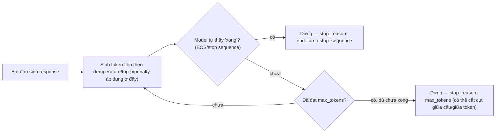

# Max Length — giới hạn cứng số token model được phép sinh ra trong một response

**Max Length** (tham số API: `max_tokens` ở cả Claude Messages API lẫn OpenAI Chat Completions) là một **generation control** đặt trần cứng cho **số token tối đa model được phép sinh thêm** trong một lượt response — khác với [[llm-temperature]], [[llm-top-p]], [[llm-frequency-penalty]], [[llm-presence-penalty]] (đều tác động vào việc **chọn token nào** ở mỗi bước sinh), max length không đụng vào quá trình chọn token mà chỉ **đếm số token đã sinh và cắt khi chạm ngưỡng**, bất kể nội dung đã "xong" về mặt ngữ nghĩa hay chưa. Đây chính là `MaxLengthCriteria` đã nhắc tới trong [[llm-stopping-criteria]] — note này đào sâu riêng tham số này.

## Cơ chế: đếm token đã sinh, dừng khi chạm ngưỡng

(as of platform.claude.com/docs/en/api/messages, confidence: medium) `max_tokens` là tham số **bắt buộc** trong mọi request tới Claude Messages API — không có default cố định, giá trị tối đa khả dụng khác nhau tuỳ model. Mô tả chính thức: *"model có thể dừng trước khi chạm tới mức tối đa này — tham số chỉ quy định trần tuyệt đối"*, nghĩa là max_tokens là một **ceiling**, không phải mục tiêu độ dài cần đạt.



Hai kịch bản dừng khác biệt căn bản: model tự nhận biết đã hoàn tất (đạt EOS token hoặc khớp stop sequence, xem [[llm-stopping-criteria]]) so với bị **cắt cụt cưỡng bức** vì hết ngân sách token — trong trường hợp thứ hai, output có thể dừng giữa từ, giữa câu, hoặc giữa một `tool_use` block chưa hoàn chỉnh.

## `stop_reason` khi bị cắt

(as of platform.claude.com/docs/en/api/messages, confidence: medium) Khi response bị `max_tokens` cắt, Claude Messages API trả về `stop_reason: "max_tokens"` — một trong các giá trị `stop_reason` khả dĩ bên cạnh `end_turn`, `stop_sequence`, `tool_use`, `pause_turn`, `refusal`, `model_context_window_exceeded`. Việc kiểm tra `stop_reason` sau mỗi lần gọi là cách duy nhất để phân biệt "model nói xong tự nhiên" với "model bị cắt giữa chừng" — im lặng bỏ qua giá trị này dễ khiến ứng dụng coi một response bị cụt là hoàn chỉnh.

```json
// Request
{
  "model": "claude-opus-4-6",
  "max_tokens": 20,
  "messages": [{"role": "user", "content": "Giải thích chi tiết về black hole"}]
}

// Response (bị max_tokens cắt cụt)
{
  "content": [{"type": "text", "text": "Black hole là một vùng không-thời gian có lực hấp dẫn cực mạnh, đến mức"}],
  "stop_reason": "max_tokens",
  "stop_sequence": null
}
```

Khi gặp `stop_reason: "max_tokens"`, hai hướng xử lý thường gặp: tăng `max_tokens` và gọi lại từ đầu, hoặc nối phần nội dung đã có vào `messages` như một lượt trước đó và yêu cầu model "tiếp tục" sinh — cách thứ hai tránh lãng phí phần đã sinh ra nhưng cần model hỗ trợ tốt việc tiếp nối văn phong đang dang dở.

## `max_tokens` khác context window

(as of platform.claude.com/docs/en/api/messages, confidence: medium) `max_tokens` là ngân sách **chỉ cho phần output**, tách biệt khỏi [[llm-context-window]] — vốn là tổng dung lượng **input + output**. Nếu `input_tokens + max_tokens` vượt quá context window của model, request trả về `stop_reason: "model_context_window_exceeded"` — một điều kiện dừng độc lập, xảy ra ngay cả khi `max_tokens` đặt cao nhưng prompt đã chiếm gần hết context window. Đặt `max_tokens` cao không tự động đảm bảo model được phép sinh hết mức đó — vẫn bị giới hạn bởi phần context window còn trống sau khi trừ input.

Một điểm đặc biệt: (as of platform.claude.com/docs/en/api/messages, confidence: medium) `max_tokens` có thể set bằng `0` — dùng để **populate prompt cache mà không sinh response nào**, một use case thuần kỹ thuật khác hẳn mục đích kiểm soát độ dài thông thường.

## Trade-off: giá trị nhỏ vs giá trị lớn

| Giá trị | Ưu điểm | Rủi ro |
|---|---|---|
| Nhỏ (VD vài chục–vài trăm token) | Giảm latency, giảm chi phí (tính theo output token, xem [[llm-token-pricing]]), phù hợp task cần output ngắn (classification, extraction, tweet-length text) | Dễ cắt cụt output giữa chừng nếu nội dung cần dài hơn dự kiến — đặc biệt nguy hiểm khi model đang giữa một `tool_use` block, khiến tool call bị hỏng cấu trúc |
| Lớn (VD vài nghìn–hàng chục nghìn token) | Cho phép output dài, chi tiết, giảm rủi ro bị cắt cụt giữa chừng | Tăng latency và chi phí tối đa có thể phát sinh mỗi request (dù model có thể dừng sớm hơn); nếu cộng với input đã lớn, dễ chạm `model_context_window_exceeded` |

Nguyên tắc thực dụng: đặt `max_tokens` theo **độ dài kỳ vọng thực tế của task**, không phải cứ đặt tối đa cho an toàn — vì (1) chi phí tối đa bị đẩy lên theo giá trị đặt dù model có thể không dùng hết, và (2) với các API tính phí theo token đã sinh thực tế (không phải theo `max_tokens` đặt), rủi ro chính không phải là chi phí mà là **latency budget** bị đặt sai kỳ vọng khi lập kế hoạch hệ thống.

## Khác biệt với các stopping criteria khác

`max_tokens` là một trong nhiều điều kiện dừng, nhưng là điều kiện **duy nhất không quan tâm nội dung** — xem bảng so sánh đầy đủ ở [[llm-stopping-criteria]]:

| Điều kiện dừng | Có xét nội dung? | Có thể cắt cụt giữa câu/block? |
|---|---|---|
| EOS token / model tự nhận biết xong | Có | Không |
| Stop sequence khớp chuỗi định trước | Có (khớp chuỗi cụ thể) | Có thể, nếu chuỗi xuất hiện giữa ý |
| **`max_tokens` (max length)** | **Không — chỉ đếm số lượng** | **Có, thường xuyên nhất trong các điều kiện dừng** |
| Context window đầy | Không | Có |

Vì không xét nội dung, `max_tokens` là điều kiện dừng "thô bạo" nhất trong nhóm — hữu ích như một **safety net** chống model sinh vô hạn (xem [[llm-stopping-criteria]] mục về rủi ro không có giới hạn), nhưng không nên là cơ chế chính để kiểm soát *hình dạng* output; việc đó nên giao cho prompt engineering hoặc structured output (schema, `tool_use` bắt buộc).

## Liên hệ tới các phần khác

- Cùng nhóm **generation controls** với [[llm-temperature]], [[llm-top-p]], [[llm-frequency-penalty]], [[llm-presence-penalty]] trong prerequisite layer của [[ai-engineer-roadmap]] — nhưng khác nhóm cơ chế: các tham số kia định hình *việc chọn token*, còn max length chỉ *đếm và cắt*.
- [[llm-stopping-criteria]]: max length là một trong các loại stopping criteria (`MaxLengthCriteria` trong Hugging Face `transformers`, `max_tokens` trong Claude/OpenAI API) — note đó liệt kê tổng quan các loại, note này đào sâu riêng loại này.
- [[llm-context-window]]: `max_tokens` là ngân sách con nằm trong tổng context window — output token luôn phải chia sẻ chỗ với input token trong cùng một giới hạn context window của model.
- [[llm-token-pricing]]: `max_tokens` không trực tiếp quyết định chi phí (chi phí tính theo token *thực sự sinh ra*), nhưng là trần trên cho chi phí tối đa có thể phát sinh mỗi request — cần cân nhắc khi ước tính ngân sách vận hành.

## Giới hạn / open questions
- Chưa fetch được nội dung gốc của 3/4 nguồn ban đầu do người dùng cung cấp (help.openai.com trả về 403, restack.io redirect không tới được nội dung con, bài Medium về Bedrock chưa fetch) — nội dung note này chủ yếu dựa trên tài liệu chính thức Claude Messages API, chưa đối chiếu trực tiếp cách OpenAI hay Amazon Bedrock trình bày tham số tương đương (`max_tokens`/`max_completion_tokens` bên OpenAI có thể có khác biệt hành vi nhỏ, VD với reasoning models cần token cho phần suy luận ẩn).
- Chưa có số liệu cụ thể (bảng) về giá trị mặc định/tối đa của `max_tokens` theo từng model Claude — tài liệu gốc trỏ tới trang models overview riêng, chưa tổng hợp vào note này.
- Chưa kiểm chứng hành vi cụ thể khi `max_tokens` cắt giữa một `tool_use` block — mô tả trong note này (tool call bị hỏng cấu trúc) là suy luận hợp lý từ cơ chế, chưa có ví dụ log thực tế minh hoạ.
