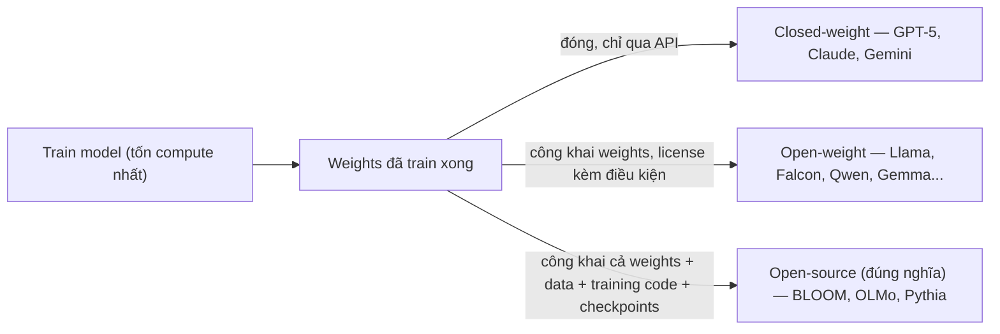

# Open-weight models — model families & licenses

**Open-weight model** là model đã train xong mà **trọng số (weights)** — tức các tham số đã học được sau training — được công khai cho bất kỳ ai tải về. Ai cũng có thể tải file weights, chạy model (local hoặc trên cloud riêng), fine-tune theo nhu cầu, hoặc xây tool/sản phẩm trên nền model đó. Đi kèm mỗi model là một **license** quy định cụ thể được phép làm gì — có license rất permissive, cho cả dùng thương mại; có license chỉ cho nghiên cứu/dự án cá nhân. Vì weights công khai, cộng đồng có thể soi cách model hoạt động, kiểm tra bias, đề xuất fix. Open weights cũng giảm chi phí vì team không cần train một model lớn từ đầu (chi phí compute cho pretraining một model cỡ lớn có thể lên tới hàng triệu USD). Các ví dụ nổi bật: BLOOM, Falcon, Llama.

## Open-weight vs open-source — không phải đồng nghĩa (confidence: high — đây là tranh cãi lớn trong ngành, không phải chi tiết vặt)

Hai từ này hay bị dùng lẫn lộn nhưng khác nhau rõ rệt (as of stackviv.ai "Open Weights vs Open Source AI"):

| | Weights | Training data | Training/pipeline code | Checkpoints trung gian | License cho phép reproduce từ đầu |
|---|---|---|---|---|---|
| **Open-weight** (Llama, Falcon, Qwen, Gemma, DeepSeek, Mistral, Phi) | ✅ công khai | ❌ thường giữ kín | ❌ thường giữ kín | ❌ hiếm khi có | ❌ không tái tạo được từ đầu |
| **Open-source (đúng nghĩa)** (BLOOM, OLMo, Pythia) | ✅ công khai | ✅ công khai | ✅ công khai | ✅ thường có | ✅ có thể reproduce |

Điểm mấu chốt: **"mở weights" không đồng nghĩa "mở nguồn"** — bạn tải và chạy được model, nhưng không biết chính xác nó được train trên data gì hay bằng pipeline nào, nên không thể tự tái tạo lại model từ đầu. Theo Open Source Definition (định nghĩa gốc cho phần mềm mã nguồn mở), một license có điều khoản phân biệt đối xử theo người dùng/mục đích sử dụng thì không được coi là "open source" — đây là lý do Wikipedia và nhiều tổ chức xếp Llama vào nhóm open-weight chứ không phải open-source, dù Meta hay marketing là "open source" (as of kingy.ai, stackviv.ai) (confidence: medium — đây là điểm gây tranh cãi, các bên có định nghĩa khác nhau).

## Các model family & license tiêu biểu

| Model family | Tổ chức | License | Điều kiện thương mại | Ghi chú |
|---|---|---|---|---|
| **BLOOM** | BigScience (cộng đồng nghiên cứu mở, HuggingFace hỗ trợ hạ tầng) | RAIL License (Responsible AI License) | Cho phép, kèm điều khoản dùng có trách nhiệm | Open-source đúng nghĩa — cả data lẫn training code đều công khai |
| **Falcon 3** | TII (Technology Innovation Institute, Abu Dhabi) | Falcon-LLM License 2.0 (dựa trên Apache 2.0) | Miễn phí, không giới hạn | 1B–10B tham số, train trên 14T token (as of computingforgeeks.com) |
| **Llama 2 / 3 / 4** | Meta | Llama Community License (license riêng của Meta, không phải OSI-approved) | Miễn phí **nếu** số MAU (monthly active users) của sản phẩm dùng Llama < 700 triệu — vượt ngưỡng này phải xin license riêng từ Meta; cấm dùng Llama để train model khác cạnh tranh | Ngưỡng 700M MAU + acceptable-use policy loại trừ một số quyền (VD: quyền multimodal cho tổ chức/cá nhân tại EU trong Llama 4) khiến license này **không đạt chuẩn open-source** dù thường được gọi là "open source" trên truyền thông (as of ai.meta.com/llama/license, ai.meta.com/llama/use-policy) |
| Qwen, Gemma, DeepSeek, Mistral, Phi | Alibaba, Google, DeepSeek, Mistral AI, Microsoft | Mỗi hãng một license riêng (Apache 2.0, Gemma Terms, MIT-like...) | Khác nhau tuỳ hãng — luôn đọc license cụ thể trước khi dùng thương mại | Tính đến 2026, nhiều hãng lớn cùng đua ra model open-weight cạnh tranh trực tiếp với model closed-weight cả về benchmark lẫn khả năng chạy trên GPU consumer (as of kingy.ai "State of Open-Weight AI Models") (confidence: medium — bảng xếp hạng benchmark thay đổi liên tục) |

**Nguyên tắc chung khi chọn model open-weight cho dự án thật:** không tin vào nhãn "open source" trên marketing — luôn đọc trực tiếp file LICENSE + acceptable-use-policy của từng model, đặc biệt các điều khoản: ngưỡng MAU/doanh thu, cấm dùng để train model cạnh tranh, giới hạn theo khu vực (VD: loại trừ EU), và điều khoản attribution bắt buộc.

## Vì sao chọn open-weight thay vì API (closed-weight)

- **Kiểm soát dữ liệu** — chạy model on-premise/private cloud, dữ liệu nhạy cảm không rời khỏi hạ tầng của mình, không bị gửi qua API bên thứ ba.
- **Có thể fine-tune sâu** — chỉnh trực tiếp trọng số cho domain riêng (xem [[llm-fine-tuning]]), thay vì chỉ prompt engineering qua API.
- **Không phụ thuộc rate limit/pricing của provider** — chi phí chuyển từ "trả theo token qua API" sang "chi phí hạ tầng tự host" (xem phần self-host trong [[llm-token-pricing]] — điểm hoà vốn giữa hai mô hình phụ thuộc khối lượng sử dụng).
- **Minh bạch/kiểm tra được** — cộng đồng research có thể soi kiến trúc, dò bias, audit an toàn — quan trọng với ứng dụng cần giải trình (compliance, y tế, tài chính).
- **Đánh đổi:** thường kém hơn model closed-weight top-tier (GPT-5, Claude, Gemini) ở các benchmark khó nhất, và tự host đòi hỏi tự lo hạ tầng GPU, MLOps, scaling — không "miễn phí" như tưởng (xem lại phần self-host trong [[llm-token-pricing]]).

## Nơi theo dõi / đánh giá model open-weight

- **[Hugging Face Open LLM Leaderboard](https://huggingface.co/spaces/HuggingFaceH4/open_llm_leaderboard)** — bảng xếp hạng benchmark chuẩn hoá giữa các model open-weight, dùng để so sánh trước khi chọn model cho use case cụ thể.
- **[EleutherAI](https://www.eleuther.ai/)** — tổ chức nghiên cứu phi lợi nhuận đi đầu phong trào open-weight/open-source LLM từ trước khi ChatGPT ra mắt (GPT-Neo, GPT-J, Pythia...), cũng duy trì bộ công cụ eval (`lm-evaluation-harness`) được cộng đồng dùng rộng rãi để benchmark model.
- **[BigScience](https://bigscience.huggingface.co/)** — cộng đồng nghiên cứu quốc tế đứng sau BLOOM, mô hình open-source đúng nghĩa hiếm hoi ở quy mô lớn.
- **[TII Falcon LLM](https://falconllm.tii.ae/)** — trang chính thức của dòng Falcon.
- **[Meta Llama](https://ai.meta.com/llama/)** — trang chính thức, kèm link license/use-policy cần đọc kỹ trước khi dùng thương mại.

## Giới hạn / open questions
- Chưa cover chi tiết **model families khác** ngoài BLOOM/Falcon/Llama (Qwen, Gemma, DeepSeek, Mistral, Phi) — bảng ở trên mới liệt kê sơ bộ, cần note riêng nếu đào sâu benchmark/kiến trúc từng dòng.
- Chưa cover **fine-tuning thực hành** trên model open-weight (LoRA/QLoRA, full fine-tune, chi phí GPU cụ thể) — xem [[llm-fine-tuning]] cho phần đã có, phần gắn riêng với open-weight vẫn để trống.
- License thay đổi theo version — Llama 2 khác Llama 3 khác Llama 4 về điều khoản cụ thể (VD: ngưỡng MAU, loại trừ khu vực) — trước khi dùng thương mại thật, luôn đọc lại license của đúng version đang dùng thay vì tin vào bảng tóm tắt trong note này.
- Chưa đào sâu **self-hosting infra** (serving framework như vLLM/TGI, quantization để chạy trên GPU nhỏ hơn) — thuộc nhóm `infra-` trong [[ai-engineer-roadmap]], hiện `planned`.
