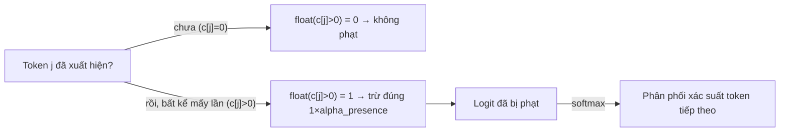

# Presence Penalty — phạt việc TÁI SỬ DỤNG một token đã xuất hiện, bất kể lặp bao nhiêu lần

**TL;DR**: Presence penalty trừ một khoản logit **cố định, một lần** (như cờ boolean 0/1) cho bất kỳ token nào đã xuất hiện ít nhất 1 lần trong response — khác với [[llm-frequency-penalty]] vốn trừ **tỷ lệ thuận với số lần lặp**; presence penalty nghiêng về đẩy model sang **chủ đề/từ mới** hơn là chỉ chống lặp liên tục.

## Cơ chế: công thức logit chính thức của OpenAI

Theo tài liệu "Advanced usage" chính thức của OpenAI, cả `frequency_penalty` và `presence_penalty` cùng chia sẻ một công thức điều chỉnh **logit** (điểm số thô của model cho mỗi token, trước khi qua **softmax** để chuyển thành xác suất) (as of developers.openai.com, confidence: high):

```
mu[j] = mu[j] - c[j] * alpha_frequency - float(c[j] > 0) * alpha_presence
```

- `mu[j]`: logit của token j.
- `c[j]`: số lần token j đã được sinh ra trong response tính tới thời điểm hiện tại.
- `alpha_frequency`, `alpha_presence`: hệ số do người dùng set cho hai tham số.

Điểm mấu chốt nằm ở `float(c[j] > 0)` — đây là một **indicator function** (hàm chỉ trả về `1` hoặc `0` tuỳ điều kiện đúng/sai), chỉ trả về `1` nếu token đã xuất hiện ít nhất 1 lần, và `0` nếu chưa từng xuất hiện — **không nhân với số lần đếm thực tế**. Vì vậy khoản phạt presence penalty là **một lần, cố định**, áp dụng ngay khi token vừa xuất hiện lần đầu, và **không tăng thêm** dù token đó lặp lại thêm bao nhiêu lần nữa.



So sánh trực tiếp hai số hạng trong cùng công thức:

| Tham số | Số hạng trong công thức | Bản chất phép trừ |
|---|---|---|
| Frequency penalty | `c[j] * alpha_frequency` | Tỷ lệ thuận với số lần lặp — lặp càng nhiều, phạt càng nặng |
| Presence penalty | `float(c[j] > 0) * alpha_presence` | Cố định, một lần — chỉ hỏi "đã xuất hiện hay chưa", không quan tâm số lần |

## Ví dụ cụ thể

Ví dụ minh hoạ (định tính, theo vellum.ai):

- **Không có penalty**: "The dog is barking. The dog is playing. The dog is running." — "dog" lặp lại nguyên văn cả 3 câu.
- **Có presence penalty dương**: "The dog is barking. **The cat** is playing. **The rabbit** is running." — ngay khi "dog" xuất hiện lần đầu (câu 1), nó đã bị đánh dấu phạt; model né dùng lại "dog" ở câu 2 lẫn câu 3, chuyển hẳn sang từ mới thay vì chỉ giảm dần như frequency penalty.

Ví dụ số minh hoạ công thức (giả định `alpha_presence = 0.6`, `alpha_frequency = 0`, token "dog" đã xuất hiện 3 lần):

- Với **presence penalty**: `mu[dog] = mu[dog] - 1 * 0.6 = mu[dog] - 0.6` (chỉ trừ đúng 1 lần dù đã lặp 3 lần).
- Với **frequency penalty** cùng hệ số: `mu[dog] = mu[dog] - 3 * 0.6 = mu[dog] - 1.8` (trừ tăng dần theo số lần).

## Range và giá trị khuyến nghị

| Giá trị | Ý nghĩa |
|---|---|
| `0` (mặc định) | Tắt hẳn — không phạt token đã xuất hiện |
| Dương nhẹ (~0.1 – 1) | Khuyến khích đa dạng chủ đề/từ vựng ở mức vừa phải (light suppression) |
| Dương cao (đến 2) | Ép mạnh model tránh mọi token đã dùng — có thể làm giảm chất lượng output (câu cú bất thường, dùng từ lạ) |
| Âm | Khuyến khích **lặp lại** token đã dùng — hữu ích cho văn có vần, danh sách lặp khuôn mẫu |

Range chính thức trên OpenAI API (Chat Completions) là `-2.0` đến `2.0`, mặc định `0` (as of platform.openai.com, confidence: medium).

## Khác biệt với frequency penalty — khi nào dùng cái nào

- **Presence penalty**: "nghiêm khắc hơn" (stricter) — phạt ngay từ lần lặp thứ 2 trở đi bất kể mức độ, phù hợp khi muốn model **chuyển chủ đề/dùng từ mới** thay vì quanh quẩn một vài từ khoá — ví dụ chatbot chăm sóc khách hàng cần tránh lặp tên/cụm từ.
- **Frequency penalty**: phạt tăng dần theo số lần — phù hợp hơn cho văn bản dài (essay, nội dung sáng tạo) nơi cần giảm dần các cụm từ bị lặp khuôn mẫu nhưng vẫn cho phép từ chức năng thông dụng (mạo từ, giới từ...) xuất hiện lại tự nhiên mà không bị phạt nặng ngay từ lần đầu.
- Hai tham số **cộng dồn** khi cùng bật — cùng trừ vào chung một logit trước softmax theo đúng công thức `mu[j] = mu[j] - c[j]*alpha_frequency - float(c[j]>0)*alpha_presence`, xem chi tiết cơ chế frequency ở [[llm-frequency-penalty]].

## Liên hệ tới các phần khác

- Cùng nhóm **generation controls** với [[llm-temperature]], [[llm-top-p]] và [[llm-frequency-penalty]] trong prerequisite layer của [[ai-engineer-roadmap]] — cả 4 tham số này can thiệp ở tầng logit/sampling, được set cùng lúc trong một lần gọi API sinh văn bản. Suy luận (chưa kiểm chứng sâu, xem mục "Giới hạn"): kể cả trong workflow phức tạp hơn như RAG, penalty có thể chỉ tính trên token được SINH RA ở output, không tính token có sẵn trong prompt/context đầu vào.
- Presence/frequency penalty là cơ chế đặc thù của API kiểu OpenAI (Chat Completions) — không phổ quát cho mọi provider.

### Áp dụng với Claude Code

**Không áp dụng.** Anthropic Messages API — API nền của Claude Code — chỉ định nghĩa các tham số sampling `temperature`, `top_p`, `top_k`; schema request body **không có** field `presence_penalty`, `frequency_penalty`, hay `repetition_penalty` nào (as of platform.claude.com, confidence: high — xác nhận thêm bởi bảng so sánh tham số đa provider của hidekazu-konishi.com).

Hệ quả thực tế:

- Với một số model Claude mới (4.7+), Anthropic thậm chí còn không cho set `temperature`/`top_p`/`top_k` khác mặc định (trả lỗi 400) — nghĩa là Claude Code càng không có cách nào truyền `presence_penalty` qua CLI flag hay `settings.json`.
- Nếu cần hiệu ứng "tránh lặp/tránh quanh quẩn một chủ đề" khi dùng Claude, phải xử lý bằng **prompt engineering** (yêu cầu rõ tránh lặp ý) hoặc post-processing, không có tham số API tương đương.

## Giới hạn / open questions

- Chưa có benchmark định lượng cho thấy mức `alpha_presence` cụ thể nào tương ứng với mức giảm lặp/tăng đa dạng chủ đề bao nhiêu % — các mốc "0.1–1 nhẹ, đến 2 mạnh" trong note này là khuyến nghị định tính từ OpenAI/Vellum, không phải số đo thực nghiệm.
- Chưa rõ liệu các provider khác ngoài OpenAI (ngoài Anthropic đã xác nhận không hỗ trợ) có expose tham số tương đương presence penalty hay không — cần khảo sát thêm khi làm việc đa provider.
- Tuyên bố về hành vi presence penalty trong workflow RAG/multi-step (chỉ tính trên token output, không tính token trong prompt) mới ở mức suy luận từ cơ chế chung, chưa có nguồn chính thức xác nhận trực tiếp — confidence thấp, cần kiểm chứng thêm nếu áp dụng vào thiết kế hệ thống thực tế.
