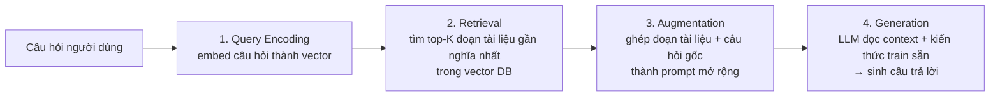
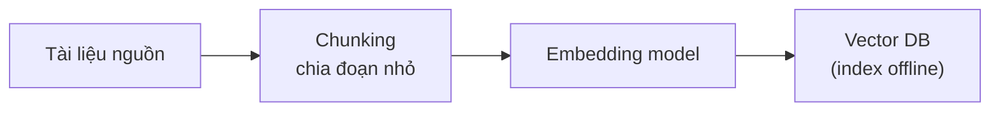

# RAG (Retrieval-Augmented Generation) — cơ bản

RAG là kỹ thuật cho LLM **"tra cứu trước khi trả lời"**: thay vì chỉ dựa vào kiến thức đã học lúc training (đóng băng tại thời điểm cutoff), hệ thống chủ động tìm (retrieve) các đoạn thông tin liên quan từ một nguồn tri thức ngoài (tài liệu, database...), rồi đưa các đoạn đó vào context cho LLM đọc và sinh câu trả lời (confidence: high). Đây chính là use case nền tảng của [[llm-embedding]] — "Embedding process" mục Embedding với LLM đã nói tới cơ chế embed tài liệu/câu hỏi để tìm đoạn gần nghĩa nhất.

Vì sao cần: LLM có 2 giới hạn cố hữu — (1) kiến thức đóng băng ở thời điểm training, không biết thông tin mới hoặc dữ liệu riêng tư/nội bộ của tổ chức, và (2) **hallucination** — bịa thông tin nghe hợp lý nhưng sai khi không chắc chắn. RAG giải quyết cả hai bằng cách "ground" (neo) câu trả lời vào tài liệu nguồn thật, có thể trích dẫn được (as of v7labs.com, learn.microsoft.com) (confidence: high).

## Pipeline cơ bản — 4 bước

1. **Query Encoding** — câu hỏi của người dùng được embed thành vector bằng cùng loại embedding model đã dùng để index tài liệu (xem [[llm-embedding]]).
2. **Retrieval** — vector câu hỏi được so sánh (cosine similarity...) với các vector tài liệu đã lưu sẵn trong vector database, lấy ra top-K đoạn (chunk) gần nghĩa nhất. Đây là bước cốt lõi khiến RAG khác semantic search thuần: mục tiêu không phải trả cả tài liệu mà là các "retrieval" — đoạn trích đủ nhỏ để nhét vừa context window.
3. **Augmentation** — các đoạn retrieve được ghép cùng câu hỏi gốc thành một prompt "làm giàu" (augmented prompt), thường kèm chỉ dẫn kiểu "chỉ trả lời dựa trên các đoạn tài liệu dưới đây".
4. **Generation** — LLM sinh câu trả lời cuối cùng, kết hợp thông tin vừa đọc được (retrieved context) với kiến thức nền đã học lúc training.

Trước bước 1, tài liệu nguồn phải được **index (offline, một lần)**: chia nhỏ thành chunk → embed từng chunk → lưu vào vector DB — quy trình này giống hệt "Embedding process" đã mô tả ở [[llm-embedding]].

## Naive RAG vs Advanced RAG vs Modular RAG

Không phải mọi RAG đều đơn giản như 4 bước ở trên — ba mức độ phức tạp thường được nhắc tới (as of zilliz.com, meilisearch.com) (confidence: medium — ranh giới giữa các mức không hoàn toàn chuẩn hoá, tuỳ nguồn):

| Mức | Đặc điểm | Nhược điểm / khi dùng |
|---|---|---|
| **Naive RAG** | "Retrieve-then-read" thuần: embed câu hỏi → tìm top-K → nhét thẳng vào prompt → generate. Không có bước tinh chỉnh nào thêm. | Precision thấp (lấy nhầm đoạn không liên quan), recall thấp (bỏ sót đoạn liên quan). Phù hợp prototype, chatbot nội bộ ưu tiên tốc độ/đơn giản hơn độ chính xác. |
| **Advanced RAG** | Thêm các lớp tinh chỉnh: **query rewriting** (viết lại câu hỏi mơ hồ cho rõ nghĩa trước khi retrieve), **hybrid search** (kết hợp semantic search + keyword/BM25 để không bỏ sót match từ khoá chính xác), **reranking** (dùng cross-encoder chấm điểm lại top-K thô để sắp xếp chính xác hơn), **multi-hop/multi-stage retrieval** (truy vấn nhiều vòng khi 1 lần retrieve chưa đủ). | Độ chính xác cao hơn hẳn, đánh đổi latency/chi phí tính toán. Phù hợp hệ thống enterprise cần độ tin cậy. |
| **Modular RAG** | Naive RAG và Advanced RAG chỉ là trường hợp đặc biệt của Modular RAG — pipeline được tách thành các module rời (search, memory, fusion, routing, predict, task adapter...) có thể hoán đổi/sắp xếp lại tuỳ bài toán, thay vì một luồng cố định. | Linh hoạt nhất, nhưng phức tạp hơn để thiết kế/vận hành. Nền tảng cho **RAG Agent** — xem nhóm `agent-` (Agent Architectures) trong [[ai-engineer-roadmap]]. |

## RAG vs Fine-tuning vs Prompt Engineering

Ba cách chính để "dạy" LLM biết thêm thông tin/hành vi mới, giải quyết vấn đề khác nhau chứ không thay thế nhau hoàn toàn (as of winder.ai, confidence: medium — khung phân loại mang tính hướng dẫn, không phải luật cứng):

- **RAG** — kiểm soát **model biết gì** (what): thông tin thay đổi liên tục, cần trích dẫn nguồn (compliance/audit), dữ liệu cần tách biệt khỏi model (governance), không có sẵn dữ liệu gắn nhãn để train, cần triển khai nhanh.
- **Fine-tuning** — kiểm soát **model phản hồi thế nào** (how): cần hành vi/văn phong/format output nhất quán mà prompt không ép được ổn định, ngân sách latency không cho phép thêm bước retrieval, hoặc muốn dùng model nhỏ/mở rẻ hơn đạt chất lượng gần bằng model lớn cho một tác vụ hẹp. Nhược điểm: tốn dữ liệu + chi phí train, và có nguy cơ **catastrophic forgetting** (model quên kiến thức cũ khi học cái mới) — RAG không gặp vấn đề này vì không đụng vào trọng số model.
- **Prompt engineering** — cách rẻ/nhanh nhất, không cần hạ tầng retrieval hay training, nhưng giới hạn bởi kiến thức model đã có sẵn và độ dài context window.

Trong thực tế 2026, phần lớn hệ thống production dùng **kết hợp cả ba**: fine-tune để cố định hành vi/văn phong, RAG để cấp thông tin cụ thể/mới nhất, prompt engineering để điều khiển từng lần gọi — các benchmark gần đây cho thấy cách kết hợp (hybrid) vượt trội so với chỉ dùng riêng RAG hoặc riêng fine-tuning (as of winder.ai) (confidence: low — con số benchmark cụ thể thay đổi theo từng nghiên cứu, chỉ nên coi là xu hướng chung).

> Xem thêm [[llm-large-language-model]] mục Giới hạn — RAG là một trong các cách khắc phục knowledge cutoff/context window đã nêu ở đó.

## Kỹ thuật biến thể (tham khảo, chưa đào sâu)

- **RAG-Sequence** — dùng cùng 1 tài liệu retrieve được cho toàn bộ câu trả lời.
- **RAG-Token** — cho phép mỗi token trong câu trả lời tham chiếu tài liệu khác nhau, linh hoạt hơn nhưng phức tạp hơn để implement.

(as of v7labs.com) (confidence: low — đây là chi tiết kỹ thuật từ paper gốc RAG, ít gặp trong pipeline RAG ứng dụng thực tế ngày nay vốn thường đơn giản hơn nhiều)

## Giới hạn / open questions
- Chưa đào sâu **chunking strategies** (chia tài liệu sao cho tối ưu retrieval mà không mất ngữ cảnh) — để dành cho note `rag-chunking-strategies` (đã có trong [[ai-engineer-roadmap]], `planned`).
- Chưa đào sâu **hybrid search & reranking** (BM25 + vector, cross-encoder rerank) — để dành cho note `rag-hybrid-search-reranking` (planned trong roadmap).
- Chưa cover **RAG Agent** (agent tự quyết định khi nào cần retrieve, retrieve nhiều vòng, tự đánh giá kết quả) — thuộc nhóm Agent Architectures (`agent-`) trong roadmap, cần note riêng.
- Chưa cover cách đánh giá chất lượng RAG (faithfulness, answer relevancy, context precision/recall — Ragas...) — thuộc nhóm Evaluation & Testing (`eval-`) trong roadmap.
