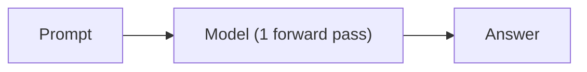
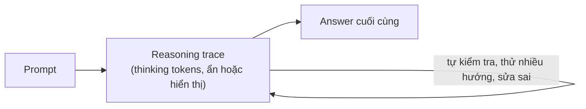
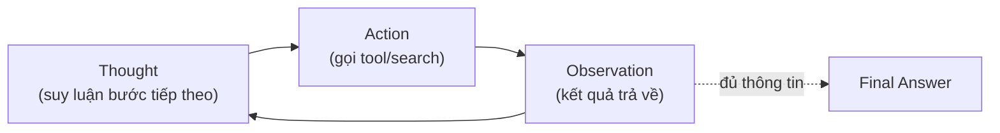

# Reasoning vs Standard Models

Hai kiểu LLM khác nhau ở **cách sinh câu trả lời**, không phải ở kiến trúc Transformer nền tảng (xem [[llm-large-language-model]]) (confidence: high):

- **Standard model** — nhận prompt, sinh token trả lời gần như ngay lập tức trong **một lượt forward-pass tuần tự** (autoregressive next-token prediction thuần), không có bước "suy nghĩ" tách riêng trước khi trả lời.
- **Reasoning model** — trước khi trả lời, model sinh ra một **chuỗi reasoning token nội bộ** (internal reasoning trace/"thinking tokens") để tự phân tích, kiểm tra lại, thử nhiều hướng giải — rồi mới sinh câu trả lời cuối cùng dựa trên chuỗi suy luận đó (as of 2026, zylos.ai) (confidence: high).

Khác biệt cốt lõi không nằm ở việc model "có tư duy" hay không (cả hai đều chỉ là next-token prediction), mà nằm ở việc **có được train + được cấp compute budget riêng cho một giai đoạn suy luận trung gian trước khi chốt câu trả lời** hay không.

## Standard model hoạt động thế nào

- Câu trả lời được sinh trực tiếp — token đầu tiên của answer bắt đầu ngay sau khi model xử lý xong prompt.
- Nhanh, rẻ, latency thấp — phù hợp chat, tra cứu, viết lách, các tác vụ không cần suy luận nhiều bước.
- Nếu muốn model "suy nghĩ" trước, phải ép bằng prompt engineering — VD kỹ thuật **Chain-of-Thought (CoT) prompting**: yêu cầu model liệt kê từng bước suy luận trong chính câu trả lời (không tách riêng khỏi output), làm output dài hơn nhưng độ chính xác các bài toán multi-step tăng đáng kể so với trả lời thẳng.

## Reasoning model hoạt động thế nào

Ba thành phần được lắp ráp lại với nhau để tạo ra reasoning model (as of 2026, zylos.ai) (confidence: medium — cách kết hợp cụ thể khác nhau giữa các lab):

1. **Chain-of-Thought làm target training**, không chỉ còn là prompt trick — model được huấn luyện để tự sinh reasoning trace dài mà không cần người dùng yêu cầu.
2. **Test-time compute (scaling ở inference)** — thay vì chỉ scale model size/data lúc train, model được cấp thêm compute **lúc suy luận** (sinh nhiều token "nghĩ" hơn trước khi trả lời) để đổi lấy độ chính xác cao hơn.
3. **Reinforcement learning trên kết quả đúng/sai** — model được RL-train để tự sửa lỗi, tự verify, thử lại hướng khác khi hướng suy luận hiện tại có vẻ sai — không chỉ generate một lần rồi dừng.

Hệ quả đo được: độ chính xác trên các bài toán nhiều bước tăng theo kiểu **logarit theo số "thinking token"** được phép sinh ra (as of 2026, anthropic.com "Claude's extended thinking") (confidence: high) — càng cho phép nghĩ nhiều, càng chính xác, nhưng lợi ích giảm dần (diminishing returns).

## So sánh nhanh

| | Standard model | Reasoning model |
|---|---|---|
| Cách sinh câu trả lời | 1 lượt, trực tiếp | Reasoning trace trước, answer sau |
| Latency | Thấp (gần tức thời) | Cao hơn — vài giây tới hơn 1 phút tuỳ độ khó (as of 2026, taskade.com) (confidence: medium) |
| Chi phí | Thấp | Cao hơn — phải trả tiền cho cả thinking token, không chỉ answer token |
| Độ chính xác multi-step (toán, code review, logic) | Thấp hơn nếu không CoT-prompt | Cao hơn rõ rệt — VD AIME 2024: GPT-4o ~12% vs OpenAI o1 ~74% pass@1 (as of 2026, taskade.com) (confidence: medium — benchmark cụ thể, không đại diện mọi domain) |
| Phù hợp cho | Chat, tra cứu, viết lách, tác vụ 1 bước | Toán nhiều bước, debug/code review phức tạp, planning, constraint satisfaction |
| Ví dụ | GPT-4o, Claude (chế độ instant) | OpenAI o1/o3, DeepSeek-R1, Claude (chế độ extended thinking) |

(as of 2026, taskade.com + zylos.ai — số liệu benchmark thay đổi nhanh theo từng model version, chỉ dùng để nắm độ lớn khoảng cách chứ không tin tuyệt đối)

## Case: Claude — hybrid reasoning model

Claude (từ Claude 3.7 Sonnet, rồi Claude 4/4.6 trở đi) là **hybrid model**: cùng một model có thể trả lời tức thời (giống standard model) hoặc bật **extended thinking** (giống reasoning model), tuỳ theo lựa chọn của developer/user (as of 2026, anthropic.com) (confidence: high).

- Extended thinking dùng **serial test-time compute** — nhiều bước suy luận tuần tự trước khi sinh answer, và (tuỳ implementation) reasoning trace có thể hiển thị cho người dùng thấy — khác các model "giấu" toàn bộ reasoning trace (VD OpenAI o-series chỉ trả về summary, không lộ full trace).
- Từ thế hệ 4.6 (Adaptive Reasoning, ra mắt ~2026-02), Claude tự đánh giá độ phức tạp của task và tự quyết có cần nghĩ hay không cùng nghĩ bao nhiêu — thay vì cấu hình cứng bằng token budget, developer set **effort level**: `standard | high | xhigh | max` (as of 2026, anthropic.com/kunya.ai) (confidence: medium — effort-level API cụ thể có thể thay đổi theo version).

## Liên hệ agent architecture: ReAct

**ReAct (Reason + Act)** — paper gốc Yao et al. 2022, arxiv.org/abs/2210.03629 — là pattern áp dụng ý tưởng reasoning vào **agent loop** chứ không chỉ vào một lượt trả lời đơn: model interleave giữa việc sinh **Thought** (suy luận) và **Action** (gọi tool/tra cứu external source), quan sát **Observation** trả về, rồi lặp lại tới khi đủ thông tin trả lời (confidence: high).

Điểm khác biệt so với CoT thuần và so với reasoning model kiểu o1/extended-thinking:

| | Chain-of-Thought | Reasoning model (o1/extended thinking) | ReAct |
|---|---|---|---|
| Suy luận dựa trên | Kiến thức nội tại model | Kiến thức nội tại model, tự verify/tự sửa | Kiến thức nội tại **+ observation từ external tool** mỗi bước |
| Có tương tác môi trường ngoài không | Không | Không (trừ khi kết hợp tool-use riêng) | Có — đây là nguyên nhân giảm hallucination |
| Khi nào dùng | Bài toán suy luận đóng, không cần dữ liệu ngoài | Bài toán multi-step cần độ chính xác cao, chấp nhận latency | Task cần tra cứu/tương tác world (search, DB, API) trong lúc suy luận |

Kết quả gốc từ paper: ReAct outperform baseline RL 34% trên ALFWorld và 10% trên WebShop; trên HotpotQA/fact verification, việc "ground" reasoning vào observation thật giúp giảm hallucination rõ rệt so với CoT thuần không tra cứu gì (as of react-lm.github.io) (confidence: high). Đây là nền tảng cho nhóm **Agent Architectures** (`agent-`) trong [[ai-engineer-roadmap]] — reasoning model (suy luận sâu, không tương tác ngoài) và ReAct (suy luận + hành động xen kẽ) giải quyết hai lớp bài toán khác nhau và **có thể kết hợp**: dùng reasoning model làm "bộ não" bên trong một ReAct loop để mỗi Thought-step tự nó cũng suy luận sâu hơn.

## Vấn đề thực tế: overthinking / underthinking

Reasoning model không phải lúc nào cũng tốt hơn:

- **Overthinking** — model reasoning-heavy tốn hàng trăm/nghìn token "nghĩ" cho câu hỏi cực đơn giản (VD "2+3=?"), lãng phí compute/latency mà không tăng độ chính xác (as of 2026, arxiv 2412.21187 "Do NOT Think That Much for 2+3=?") (confidence: medium — hiện tượng ghi nhận trên một số model/benchmark cụ thể, không phải universal).
- **Underthinking** — ngược lại, model đôi khi nhảy giữa nhiều hướng suy luận mà không đào sâu hướng nào tới cùng, dẫn tới sai dù có "nghĩ" (as of 2026, arxiv 2501.18585 "Thoughts Are All Over the Place") (confidence: medium).
- Hệ quả thực dụng: **không nên mặc định dùng reasoning model cho mọi request** — nên route theo độ phức tạp task (đây chính là lý do Claude 4.6 thêm Adaptive Reasoning để model tự quyết thay vì luôn ép nghĩ).

## Khi nào chọn cái nào

- Chat, tra cứu, viết lách, format lại text, tác vụ 1 bước rõ ràng → **standard model** (nhanh, rẻ).
- Toán nhiều bước, debug logic phức tạp, code review sâu, planning nhiều ràng buộc, bài toán có đáp án verify được → **reasoning model** (chấp nhận đánh đổi latency/cost lấy độ chính xác).
- Task cần tra cứu/tương tác dữ liệu ngoài (search, DB, API) trong lúc suy luận, không chỉ suy luận nội tại → **ReAct** (agent loop), có thể lồng reasoning model bên trong.
- Nhiều hệ thống production 2026 dùng **routing**: câu hỏi đơn giản đi qua standard/instant mode, câu hỏi phức tạp được classify rồi route sang reasoning mode — thay vì cấu hình cứng một loại cho toàn bộ traffic.

## Giới hạn / open questions
- Chưa đo benchmark thực tế (không chỉ số liệu từ blog thứ 3) để so sánh cost/latency giữa reasoning mode và standard mode trên cùng 1 task trong hệ thống của mình — cần tự benchmark khi áp dụng.
- Chưa cover **cách route tự động** giữa hai chế độ ở tầng application (model-based classifier vs rule-based) — có thể tách note riêng nếu đào sâu.
- Chưa cover chi tiết **RLHF/RL training pipeline cụ thể** đứng sau reasoning model (GRPO, PPO, verifier reward...) — để dành cho note `finetune-` nếu cần đào sâu, xem thêm training pipeline tổng quát ở [[llm-large-language-model]].
- ReAct trong note này mới dừng ở mức liên hệ khái niệm — bài học đầy đủ (few-shot prompt structure, cách implement loop, so sánh với Plan-and-Execute) để dành cho note riêng `agent-react` khi vào phần Agent Architectures của [[ai-engineer-roadmap]].
