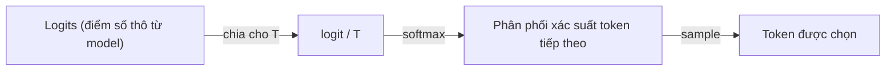

# Temperature — tham số điều chỉnh độ ngẫu nhiên khi model chọn token tiếp theo

**Temperature** là một **generation control** (tham số cấu hình lúc gọi API, không phải tham số được train) điều chỉnh mức độ ngẫu nhiên/dự đoán được của output — nó tác động trực tiếp lên **phân phối xác suất mà model dùng để chọn token tiếp theo**, chứ không đổi bản thân model hay logic suy luận (confidence: high, vellum.ai).

## Cơ chế: temperature tác động lên softmax

Sau mỗi bước forward-pass, model tính ra một vector **logit** (điểm số thô, chưa chuẩn hoá) cho toàn bộ token trong vocabulary (xem [[llm-tokenization]] về khái niệm vocabulary). Logit này được đưa qua hàm **softmax** để ra phân phối xác suất — token nào xác suất cao hơn có khả năng được chọn cao hơn. Temperature (`T`) được chia vào logit **trước khi** softmax chạy:

```
softmax(logit_i / T)
```

- **T < 1** (VD 0.2) — chia logit cho số nhỏ hơn 1 → phóng đại khoảng cách giữa logit cao và logit thấp → phân phối xác suất **nhọn hơn** (sharper), token có xác suất cao nhất gần như luôn được chọn.
- **T = 1** — giữ nguyên phân phối gốc model tính ra, không điều chỉnh gì thêm (baseline).
- **T > 1** (VD 1.5) — chia logit cho số lớn hơn 1 → thu hẹp khoảng cách giữa các logit → phân phối **phẳng hơn** (flatter), token xác suất thấp cũng có cơ hội được chọn đáng kể hơn.



Nói cách khác: temperature không thêm hay loại bỏ ứng viên nào khỏi tập token có thể chọn — nó chỉ **định hình lại độ dốc** của phân phối xác suất đã có sẵn, rồi bước sampling (xem [[llm-streamed-vs-unstreamed-responses]] mục Decoding strategies) mới thực sự chọn token dựa trên phân phối đã bị "nắn" đó.

## Ví dụ số cụ thể

Giả sử prompt là `"Con mèo đang ___"` và model vừa tính ra logit cho 4 token ứng viên (số càng cao = model càng "tự tin" đây là từ tiếp theo):

| Token | Logit thô |
|---|---|
| ngủ | 4.0 |
| chạy | 3.0 |
| ăn | 2.0 |
| bay | 0.5 |

Áp dụng công thức `softmax(logit / T)` ở 3 mức T khác nhau, xác suất mỗi token được chọn thay đổi như sau:

| Token | T = 0.5 (thấp) | T = 1.0 (baseline) | T = 2.0 (cao) |
|---|---|---|---|
| ngủ | **86.6%** | 65.2% | 46.6% |
| chạy | 11.7% | 24.0% | 28.2% |
| ăn | 1.6% | 8.8% | 17.1% |
| bay | 0.1% | 2.0% | 8.1% |

Cách đọc bảng này:
- **T = 0.5**: "ngủ" gần như chắc chắn được chọn (86.6%) — model gần như luôn trả lời "Con mèo đang ngủ", output ổn định qua nhiều lần chạy nhưng cũng dễ lặp lại, thiếu đa dạng.
- **T = 1.0**: giữ nguyên tỷ lệ mà model tính ra ban đầu — "ngủ" vẫn là lựa chọn áp đảo (65.2%) nhưng "chạy"/"ăn" có cơ hội thực sự xuất hiện.
- **T = 2.0**: khoảng cách giữa các token bị thu hẹp mạnh — "bay" (từ ít hợp lý nhất trong 4 lựa chọn) nhảy từ 2.0% lên 8.1% cơ hội được chọn, tăng hơn 4 lần. Đây là lý do T cao dễ sinh ra câu lạc đề/vô nghĩa: token vốn "khó tin" vẫn có xác suất đáng kể được sample.

Điểm mấu chốt: **thứ hạng token không đổi** ở cả 3 mức T (ngủ > chạy > ăn > bay luôn giữ nguyên) — temperature không làm model "nghĩ khác đi", nó chỉ quyết định model dám lệch khỏi lựa chọn tự tin nhất bao nhiêu khi sampling.

## Giá trị thường gặp theo provider

| Provider | Range | Default |
|---|---|---|
| OpenAI | 0.0 – 2.0 | 1.0 |
| Anthropic (Claude) | 0.0 – 1.0 | 1.0 |
| Google (Gemini) | 0.0 – 2.0 | 1.0 |

(as of vellum.ai) (confidence: medium — range/default cụ thể có thể đổi theo version API, cần re-check khi tích hợp)

Range không thống nhất giữa các provider (Anthropic giới hạn ở 1.0 trong khi OpenAI/Google cho phép tới 2.0) — vì vậy **không nên copy nguyên giá trị temperature giữa các provider khác nhau**, phải hiệu chỉnh lại theo range thực tế của model đang dùng.

## Temperature = 0 không hoàn toàn deterministic

Về lý thuyết, T càng gần 0 thì phân phối càng nhọn tới mức model gần như luôn chọn token xác suất cao nhất (**greedy decoding**, xem [[llm-streamed-vs-unstreamed-responses]]) — tưởng chừng cho ra kết quả **deterministic** (cùng input → luôn cùng output). Thực tế chỉ đạt "near non-determinism": cùng một prompt, cùng T=0, vẫn có thể ra kết quả khác nhau giữa các lần gọi do biến động phần cứng (floating-point non-associativity khi tính toán song song trên GPU, batching khác nhau giữa các request...) (as of vellum.ai) (confidence: medium — mức độ dao động cụ thể phụ thuộc infra từng provider, không phải hành vi đảm bảo bằng tài liệu chính thức).

## Ba vùng giá trị thực dụng

| Vùng | Đặc điểm | Khi nào dùng |
|---|---|---|
| Thấp (< 1.0, thường 0.0–0.3) | Trả lời ổn định, dự đoán được, ít lệch — nhưng dễ lặp lại, cứng nhắc | Documentation kỹ thuật, code generation, customer support (không được phép "bịa" chính sách hoàn tiền), tác vụ có đáp án đúng/sai rõ ràng |
| Trung bình (~1.0, mặc định) | Cân bằng giữa ổn định và đa dạng | Research/tổng hợp nội bộ, summarization — cần tự nhiên nhưng vẫn đáng tin |
| Cao (> 1.0, hoặc 0.6–0.8 theo thang một số vendor) | Output sáng tạo, đa dạng, ít lặp lại — nhưng dễ lạc đề/sai sự thật hơn | Viết content marketing, brainstorm ý tưởng, tác vụ ưu tiên đa dạng hơn độ chính xác tuyệt đối |

(tổng hợp từ vellum.ai + docsbot.ai — hai nguồn dùng thang số khác nhau vì không có "T=1.0 là chuẩn" chung giữa mọi vendor, chỉ so *tương đối* thấp/trung bình/cao trong cùng range của provider đang dùng) (confidence: medium)

Ví dụ cụ thể theo use case agent (as of docsbot.ai) (confidence: medium — khuyến nghị thực dụng của một vendor cụ thể, không phải benchmark định lượng):
- **Customer support bot** (0.1–0.3) — ưu tiên chính xác tuyệt đối, không được "improvise" khi trả lời về chính sách/troubleshooting.
- **Research & tra cứu nội bộ** (0.3–0.5) — cân bằng giữa đáng tin và câu văn tự nhiên khi tóm tắt/phân tích tài liệu.
- **Creative work** (0.6–0.8) — brainstorm, content marketing, nơi độ đa dạng ý tưởng quan trọng hơn tính nhất quán.
- **Cực cao (0.9–1.0)** — output dễ trở nên erratic (lộn xộn, khó kiểm soát); "điểm ngọt" cho sáng tạo thường dừng ở 0.6–0.8, tăng thêm không mang lại nhiều lợi ích tương xứng (diminishing returns).

## Temperature không phải cách duy nhất điều khiển randomness

Temperature thường đi kèm (và đôi khi bị nhầm lẫn với) hai tham số sampling khác — khác biệt cốt lõi: **temperature định hình lại toàn bộ phân phối xác suất đã có**, còn top-p/top-k **lọc bớt tập ứng viên** trước hoặc sau khi định hình:

| Tham số | Cơ chế | Tác động |
|---|---|---|
| **Temperature** | Chia logit trước softmax, định hình lại độ "nhọn/phẳng" của toàn bộ phân phối | Không loại token nào khỏi tập ứng viên, chỉ đổi *xác suất tương đối* giữa chúng |
| **Top-p (nucleus sampling)** — chi tiết ở [[llm-top-p]] | Chỉ giữ lại tập token nhỏ nhất có tổng xác suất ≥ p, loại phần còn lại | Giới hạn *số lượng ứng viên* được xét, tập hợp co giãn tuỳ ngữ cảnh (câu chắc chắn → tập nhỏ, câu mơ hồ → tập lớn hơn) |
| **Top-k** | Chỉ giữ lại đúng k token có xác suất cao nhất, loại phần còn lại | Giới hạn *số lượng ứng viên* cố định bất kể ngữ cảnh |

(as of vellum.ai) (confidence: medium)

Ba tham số này **kết hợp được với nhau** trong cùng một request (nhiều API cho set cả `temperature` + `top_p` + `top_k` cùng lúc) — thứ tự áp dụng thường là lọc theo top-k/top-p trước, rồi mới sample theo phân phối đã được temperature định hình lại trên tập đã lọc đó. Vì hai cơ chế (định hình phân phối vs. lọc ứng viên) độc lập nhau, chỉnh cả 3 cùng lúc mà không hiểu rõ tương tác dễ dẫn tới output khó dự đoán hơn dự định — khuyến nghị thực dụng là **chỉ chỉnh một tham số tại một thời điểm** khi thử nghiệm, giữ các tham số còn lại ở default.

## Liên hệ tới các phần khác

- Temperature chỉ có ý nghĩa ở bước **sampling** (chọn token từ phân phối) — không liên quan tới **decoding strategy nào được dùng để stream** (greedy/sampling tương thích streaming, beam search thì không), xem chi tiết ở [[llm-streamed-vs-unstreamed-responses]].
- Đây là một trong các **generation controls** cơ bản (cùng nhóm với [[llm-top-p]], [[llm-frequency-penalty]], max tokens, stop sequences) trong prerequisite layer của [[ai-engineer-roadmap]] — max tokens/stop sequences chưa có note riêng, để dành khi đào sâu tiếp.
- Không ảnh hưởng tới **reasoning trace** của reasoning model (xem [[llm-reasoning-vs-standard-models]]) — temperature tác động ở tầng chọn token, còn việc model có "suy nghĩ" nhiều/ít trước khi trả lời là một cơ chế khác (test-time compute), độc lập với temperature.
- **Claude Code (CLI) không expose temperature/top_p cho người dùng chỉnh** — không có trong `settings.json`, không có CLI flag (as of code.claude.com/docs/en/settings, confidence: medium). Đây là chủ đích: agentic coding tool cần output ổn định/có cấu trúc cho tool-calling nên harness cố định sẵn tham số sampling, không để người dùng tự do chỉnh như khi gọi thẳng API. Muốn chỉnh temperature/top_p, phải đi qua **Anthropic API trực tiếp** (set trong request body của `messages.create(...)`) hoặc **Claude Agent SDK** khi tự build agent riêng — không phải qua Claude Code. Ngoài ra, từ Opus 4.1 trở đi API còn **không cho set cả `temperature` và `top_p` cùng lúc** trong một request, đúng như khuyến nghị "chỉ chỉnh một tham số tại một thời điểm" ở mục "Temperature không phải cách duy nhất điều khiển randomness" phía trên (as of github.com/ccbogel/QualCoder issue #1125, confidence: medium — quan sát từ báo lỗi cộng đồng, chưa đối chiếu trực tiếp với changelog chính thức của Anthropic).

## Giới hạn / open questions
- Hai nguồn `thenewstack.io` và `ibm.com/think` trả về HTTP 403 khi fetch (cả qua WebFetch lẫn `curl` trực tiếp) — nội dung 2 bài này chưa được đọc/tổng hợp vào note. Cần thử lại sau (VD qua cache khác, hoặc đọc thủ công) nếu muốn đối chiếu thêm góc nhìn/số liệu từ 2 nguồn này.
- Chưa có số liệu benchmark định lượng cụ thể (VD đo perplexity hay accuracy thay đổi thế nào theo từng mức T trên cùng một task) — các khuyến nghị 0.1–0.3 / 0.6–0.8 ở trên là **quy tắc kinh nghiệm từ vendor**, không phải kết quả đo thực nghiệm được trích dẫn trong note này.
- Chưa cover cách temperature tương tác với **reasoning model / extended thinking** — một số model giới hạn hoặc bỏ qua temperature khi reasoning mode bật (cần verify riêng theo từng provider khi áp dụng, xem thêm [[llm-reasoning-vs-standard-models]]).
