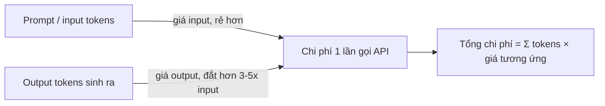

# Pricing của các model phổ biến — token-based pricing

Đa số API của LLM tính phí theo **token** — đơn vị nhỏ mà model dùng để đọc/viết văn bản, xấp xỉ **4 ký tự** hoặc **~0.75 từ tiếng Anh** (confidence: high — con số ước lượng phổ biến, số token thực tế phụ thuộc tokenizer riêng của từng model, xem chi tiết cách chia token ở [[llm-tokenization]]). Provider công bố giá theo **$/1M token** (một số nơi cũ còn ghi $/1K token) — và gần như luôn tách giá **input** (token bạn gửi vào — prompt, context, tài liệu RAG...) và **output** (token model sinh ra) vì chi phí tính toán khi generate token mới cao hơn nhiều so với đọc token có sẵn.



## Bảng giá tham khảo (as of 2026-08)

### OpenAI (as of cloudzero.com "OpenAI Pricing In 2026") (confidence: medium — giá API thay đổi thường xuyên, luôn re-check trang chính thức trước khi tính budget thật)

| Model | Input ($/1M token) | Output ($/1M token) | Ghi chú |
|---|---|---|---|
| GPT-5 | $1.25 | $10 | Thay thế GPT-4o làm model mặc định, rẻ hơn nhưng mạnh hơn |
| GPT-5 Mini | $0.25 | $2 | |
| GPT-5 Nano | $0.05 | $0.4 | Rẻ nhất dòng GPT-5 |
| GPT-4.1 | $2 | $8 | |
| GPT-4.1 Mini | $0.40 | $1.60 | |
| GPT-4.1 Nano | $0.10 | $0.40 | |
| GPT-4o | $2.50 | $10 | Model cũ hơn, đắt hơn GPT-5 dù kém mạnh hơn — minh hoạ việc giá không phải lúc nào cũng tỉ lệ thuận với "đời model mới hơn = đắt hơn" |
| GPT-4o mini | $0.15 | $0.60 | |

### Anthropic / Claude (as of cloudzero.com "Claude Pricing 2026") (confidence: medium — cùng lý do trên; giá Sonnet 5 ghi rõ là giá giới thiệu có hạn)

| Model | Input ($/1M token) | Output ($/1M token) | Ghi chú |
|---|---|---|---|
| Claude Haiku 4.5 | $1 | $5 | Rẻ nhất, cho tác vụ nhanh/khối lượng lớn |
| Claude Sonnet 5 | $2 (giới thiệu tới 2026-08-31) → $3 sau đó | $10 → $15 sau đó | Model "cân bằng", dùng phổ biến nhất cho coding/dev |
| Claude Opus 5 | $5 | $25 | Reasoning sâu, kiến trúc, nghiên cứu |
| Claude Fable 5 | $10 | $50 | Tier cao nhất |

**Cách tiết kiệm chi phí (áp dụng cho cả OpenAI/Anthropic, cơ chế tương tự):**
- **Prompt caching** — cache phần context/system prompt lặp lại giữa các lần gọi; cache hit chỉ tính ~10% giá input gốc (as of Anthropic docs) (confidence: medium).
- **Batch API** — xử lý bất đồng bộ, không cần real-time, giảm ~50% cả input lẫn output (confidence: medium).
- **Chọn model theo độ khó tác vụ** — dùng model nhỏ/rẻ (Haiku, GPT-5 Nano) cho việc đơn giản (classify, extract), chỉ dùng model lớn khi thật sự cần reasoning sâu — chênh lệch giá giữa tier rẻ nhất và đắt nhất có thể tới 50-100 lần.

### Model open-source tự host (Llama...) — "miễn phí" nhưng không thật sự miễn phí

Trọng số model (model weights) như Llama có thể tải về và dùng miễn phí, nhưng chi phí thật nằm ở **hạ tầng chạy model**:

| Khoản chi | Mức giá tham khảo | Nguồn |
|---|---|---|
| GPU cloud on-demand (H100) | ~$4.29/giờ (Lambda Labs) | gigagpu.com |
| GPU cloud on-demand (A100 80GB) | ~$1.99/giờ | gigagpu.com |
| Mua card GPU (RTX 4090 24GB) | ~$1,600–2,000/card | gigagpu.com |
| Mua card GPU (H100 80GB) | ~$25,000–35,000/card | gigagpu.com |
| Self-host Llama 3.3 70B trên GPU thuê | ~$300–600/tháng | gigagpu.com |

(as of 2026, gigagpu.com "Is Self-Hosting LLMs Cheaper Than APIs") (confidence: low — giá GPU cloud biến động mạnh theo cung/cầu, nên coi đây là số tham khảo bậc độ lớn chứ không phải giá chính xác tại thời điểm áp dụng)

**Điểm hoà vốn (break-even):** tự host chỉ rẻ hơn API khi khối lượng dùng đủ lớn — ví dụ Llama 3.3 70B tự host "đáng" từ khoảng 25 triệu token/tháng trở lên; so với GPT-4o qua API, điểm hoà vốn của Llama 3.1 70B trên hardware riêng rơi vào khoảng 100 triệu token/tháng (as of gigagpu.com) (confidence: low — phụ thuộc mạnh vào giá điện, giá thuê GPU tại từng khu vực, và mức độ tận dụng phần cứng).

### Model vision/audio — phụ phí riêng

Model xử lý ảnh/âm thanh thường tính phí cao hơn text vì tốn compute hơn để encode input phi văn bản:
- **Image analysis**: khoảng $1–5 / 1,000 ảnh tuỳ độ phân giải (as of internetsearchinc.com) (confidence: low — khoảng giá rất rộng, phụ thuộc provider).
- **Text-to-Speech**: từ $4 / 1 triệu ký tự (Google Cloud) (as of internetsearchinc.com) (confidence: low).
- **Speech recognition (Speech-to-Text)**: khoảng $0.006–0.03 / phút audio (as of internetsearchinc.com) (confidence: low).

Nhiều model đa phương thức (multimodal) quy đổi ảnh/audio thành một số lượng "token tương đương" cố định (VD: 1 ảnh ~ vài trăm đến vài nghìn token tuỳ kích thước) rồi tính chung vào giá input token bình thường — cần đọc kỹ docs từng provider vì cách quy đổi khác nhau.

## Cách ước tính chi phí một hệ thống

Công thức tổng quát khi lên kế hoạch chi phí cho một tính năng dùng LLM:

```
Chi phí ước tính = Σ (số token input × giá input) + Σ (số token output × giá output)
                    + chi phí hosting/lưu trữ (vector DB, storage log...)
                    + chi phí phụ trợ (embedding calls nếu có RAG — xem [[llm-embedding]])
```

Các bước thực hành:
1. Ước lượng số token trung bình mỗi lần gọi (input: prompt + system + context RAG nếu có; output: độ dài câu trả lời kỳ vọng).
2. Nhân với giá tương ứng của model đã chọn, theo bảng ở trên.
3. Nhân với **tần suất gọi dự kiến** (số request/ngày × số ngày) để ra chi phí theo tháng.
4. Cộng thêm chi phí hạ tầng không tính theo token: vector database, log storage, hosting nếu tự host model.
5. Áp dụng các kỹ thuật tối ưu (caching, batch, model tiering ở trên) để giảm chi phí trước khi chốt ngân sách.

## Các mô hình định giá cho AI Agent (không chỉ tính theo token thô)

Khi sản phẩm là một **AI agent** (không phải gọi API thuần), ngoài token-based pricing còn có các cách tính giá khác cho end-user, đáng biết khi tự xây sản phẩm agent để bán (as of forbes.com "Executive Guide To AI Agent Pricing") (confidence: medium — đây là các mô hình go-to-market, mang tính chiến lược kinh doanh hơn là chi phí kỹ thuật thuần tuý):

| Mô hình | Cách tính | Ví dụ |
|---|---|---|
| **Per-conversation** | Tính phí cố định mỗi phiên hội thoại | Salesforce: $2/conversation |
| **Labor replacement** | Định giá bằng % chi phí thay thế nhân sự | AI SDR ~$30/giờ so với người thật ~$50/giờ |
| **Outcome-based** | Chỉ thu phí khi đạt kết quả cụ thể | Chargeflow: 25% số tiền chargeback thu hồi được |
| **Resource/consumption-based** | Theo token, theo phút, theo giờ sử dụng | OpenAI (token), Synthesia (phút video), Copilot for Security ($4/giờ) |
| **Agentic seat** | Coi agent như một "nhân viên số" có license riêng, giống cấp seat cho người dùng | Mô hình đang nổi trong các sản phẩm agent doanh nghiệp |

Không có mô hình nào là "đúng nhất" — lựa chọn phụ thuộc mức độ chấp nhận rủi ro và pattern sử dụng thực tế của khách hàng; nhiều sản phẩm agent kết hợp nhiều mô hình cùng lúc (VD: seat cố định + usage vượt ngưỡng tính thêm theo consumption).

## Giới hạn / open questions
- Cách văn bản/code được chia thành token cụ thể theo từng tokenizer (BPE, SentencePiece...) — xem [[llm-tokenization]].
- Giới hạn tổng token input+output một lần gọi, ảnh hưởng tới cả chi phí lẫn thiết kế RAG/agent memory — xem [[llm-context-window]].
- Giá cụ thể trong bảng ở trên **sẽ lỗi thời nhanh** — trước khi tính budget thật cho một dự án, luôn kiểm tra lại trực tiếp trang pricing chính thức (openai.com/api/pricing, claude.com/pricing) thay vì tin vào con số cố định trong note này.
- Chưa cover chi phí **fine-tuning** (train job cost, hosting model đã fine-tune riêng) — thuộc nhóm `finetune-`, xem thêm [[llm-fine-tuning]].
