# Tokenization — chia văn bản thành token, bước đầu tiên trước khi model "đọc" được gì

**Tokenization** là bước biến văn bản thô (raw text) thành một chuỗi các mảnh nhỏ gọi là **token**, mỗi token được gán một **số nguyên (id)** duy nhất trong một **vocabulary** (bảng từ vựng cố định của model). Token có thể là cả một từ, một phần của từ (subword), một dấu câu, hay thậm chí một khoảng trắng — không nhất thiết trùng với ranh giới từ theo nghĩa thông thường (confidence: high). Model không xử lý trực tiếp ký tự/chữ cái — nó luôn làm việc trên chuỗi id này.

```mermaid
flowchart LR
    T["Raw text: 'transformer models'"] -->|tokenizer chia nhỏ| S["Sub-tokens: 'transform', 'er', ' models'"]
    S -->|tra vocabulary| ID["Token ids: [83, 261, 5027]"]
    ID -->|embedding lookup| E["Embedding vectors — đầu vào thật của model"]
    E --> M["Model xử lý (attention, FFN...)"]
    M -->|sinh token id tiếp theo| ID2["Output token ids"]
    ID2 -->|detokenize, tra ngược vocabulary| R["Text đọc được, trả về user"]
```

Sau khi tokenizer chuyển text thành id, model tra **embedding** cho từng id để bắt đầu tính toán (xem [[llm-embedding]]) — tokenization là bước tiền xử lý bắt buộc trước embedding, không phải cùng một bước. Sau khi model sinh xong chuỗi id output, bước **detokenization** dùng cùng bảng vocabulary để tra ngược id → text, cho ra kết quả người dùng đọc được.

## Vì sao không tokenize theo từng ký tự hay từng từ nguyên

- **Character-level** (mỗi ký tự 1 token) — vocabulary rất nhỏ, không bao giờ gặp "từ lạ" (unknown token), nhưng chuỗi token dài gấp nhiều lần → tốn context window, chậm và tốn compute hơn (attention có độ phức tạp tăng theo bình phương độ dài chuỗi).
- **Word-level** (mỗi từ 1 token) — chuỗi ngắn hơn nhiều, nhưng vocabulary phải khổng lồ để bao phủ mọi từ có thể gặp, và vẫn luôn có từ mới/từ hiếm/lỗi chính tả không nằm trong vocabulary (out-of-vocabulary problem).
- **Subword tokenization** (cách gần như mọi LLM hiện đại dùng) — điểm cân bằng giữa hai cách trên: từ phổ biến vẫn giữ nguyên thành 1 token (nhanh), từ hiếm/từ mới bị cắt thành các mảnh subword quen thuộc thay vì trở thành "unknown" (as of futureagi.com, "What is Tokenization in LLMs? 2026") (confidence: high).

## Thuật toán phổ biến: BPE (Byte Pair Encoding) và các biến thể

**BPE là thuật toán thống trị** đằng sau gần như mọi LLM hiện nay (GPT, Claude, Llama...) và các biến thể của nó (as of 2026, futureagi.com) (confidence: high). Cách hoạt động:

1. Bắt đầu từ vocabulary gồm các **byte/ký tự đơn lẻ**.
2. Quét toàn bộ corpus training, tìm **cặp token liền kề xuất hiện nhiều nhất** (VD: `t` và `h` hay đi cùng nhau).
3. Gộp (merge) cặp đó thành 1 token mới (`th`), thêm vào vocabulary.
4. Lặp lại bước 2-3 cho tới khi vocabulary đạt kích thước mục tiêu định trước (as of sebastianraschka.com "Implementing A BPE Tokenizer From Scratch", machinelearningplus.com) (confidence: high).

Kết quả: từ càng phổ biến trong training data càng có khả năng được gộp thành 1 token trọn vẹn; từ hiếm bị giữ ở dạng mảnh nhỏ hơn (gần character-level).

**Các biến thể/công cụ cụ thể theo từng lab:**
- **tiktoken** (OpenAI) — mã hoá text thành UTF-8 bytes trước, rồi chạy BPE trên các byte đó; chỉ dùng để *load* tokenizer đã train sẵn (cl100k_base cho GPT-4, o200k_base cho GPT-4o/GPT-5...), không dùng để tự train tokenizer mới.
- **SentencePiece** (Google, dùng trong nhiều model open-weight/multilingual) — chạy BPE (hoặc thuật toán Unigram) trực tiếp trên Unicode code point thay vì byte UTF-8, chỉ fallback về byte cho các code point hiếm — phù hợp hơn cho model đa ngôn ngữ.
- **WordPiece** (BERT) — họ hàng gần với BPE, chọn cặp merge theo tiêu chí xác suất (likelihood) thay vì tần suất thuần.

## Vocabulary size — càng lớn không hẳn càng tốt

| Model/Tokenizer | Vocabulary size |
|---|---|
| BERT (WordPiece) | 30,522 |
| GPT-2 (BPE) | 50,257 |
| GPT-4 (cl100k_base) | 100,277 |

(as of machinelearningplus.com, futureagi.com) (confidence: medium — số liệu tokenizer cụ thể theo từng version model, có thể thay đổi ở các model đời mới hơn)

Vocabulary lớn hơn → chuỗi token ngắn hơn cho cùng một đoạn text (tốt cho context window & tốc độ), nhưng embedding table và output layer (softmax trên toàn vocabulary) cũng lớn hơn tương ứng — đây là một trade-off thiết kế, không phải "càng to càng tốt" tuyệt đối.

## Ước tính số token thực tế — quy tắc kinh nghiệm

- Tiếng Anh: xấp xỉ **4 ký tự/token**, hoặc **~0.75 từ/token** — quy tắc phổ biến để ước lượng nhanh (as of blogs.nvidia.com "AI Tokens Explained") (confidence: medium — chỉ là ước lượng trung bình, số token thật phụ thuộc tokenizer cụ thể của từng model).
- **Ngôn ngữ khác tiếng Anh tokenize kém hiệu quả hơn** — đặc biệt tiếng Việt (có dấu, nhiều âm tiết ghép) và các ngôn ngữ CJK (Trung/Nhật/Hàn): cùng một câu thường tốn **nhiều token hơn** so với câu tiếng Anh tương đương, vì phần lớn vocabulary của các tokenizer phổ biến được tối ưu trên corpus tiếng Anh. Hệ quả trực tiếp: **cùng một lượng nội dung, request tiếng Việt tốn tiền hơn** khi tính theo token-based pricing (xem [[llm-token-pricing]]), và chiếm nhiều "chỗ" hơn trong context window (xem [[llm-context-window]]) — điều này quan trọng khi ước tính chi phí/thiết kế hệ thống cho người dùng nói tiếng Việt.

## Liên hệ tới các phần khác của LLM pipeline

- **Embeddings** — token id chỉ là index để tra bảng embedding; xem chi tiết ở [[llm-embedding]].
- **Context window** — kích thước context window luôn được đo bằng **số token**, không phải số ký tự hay số từ — tokenizer quyết định trực tiếp một đoạn text "tốn" bao nhiêu chỗ trong cửa sổ đó, xem [[llm-context-window]].
- **Token-based pricing** — provider tính tiền theo số token input/output thực tế sau khi tokenize, không phải theo độ dài văn bản thô — xem breakdown giá ở [[llm-token-pricing]].
- **Reasoning/toán học** — cách một con số hay biểu thức bị tokenize (VD: "1234" có thể bị cắt thành "12" + "34" thay vì từng chữ số riêng) được cho là một phần nguyên nhân khiến LLM đôi khi tính toán sai các phép toán nhiều chữ số, dù đây vẫn là lĩnh vực đang nghiên cứu tích cực (as of arxiv 2601.14658, "Say Anything but This: When Tokenizer Betrays Reasoning in LLMs") (confidence: low — nghiên cứu còn mới, chưa có đồng thuận rộng rãi về mức độ ảnh hưởng).

## Giới hạn / open questions
- Chưa cover kỹ thuật tự tính chính xác số token của một đoạn text theo từng tokenizer cụ thể (VD: dùng thư viện `tiktoken` để đếm token trước khi gọi API) — thuộc phần thực hành, có thể thêm ví dụ code sau nếu cần.
- Xu hướng nghiên cứu về kiến trúc **tokenizer-free / byte-level transformer** (bỏ hẳn bước tokenization, xử lý trực tiếp trên byte) đang được khám phá nhưng chưa phải mainstream trong các model production tính tới 2026-08 — cần theo dõi thêm nếu có model lớn nào áp dụng.
- Chưa đào sâu ảnh hưởng cụ thể của tokenization tới chất lượng cho tiếng Việt so với benchmark có sẵn (đa số benchmark tokenizer công khai đo trên tiếng Anh) — số liệu "tốn token hơn" ở trên là quan sát định tính phổ biến, chưa có con số benchmark cụ thể trích dẫn được.
