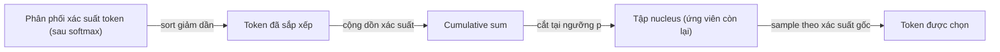

# Top-p (nucleus sampling) — lọc tập ứng viên token theo tổng xác suất tích lũy

**Top-p**, còn gọi là **nucleus sampling**, là một **generation control** điều chỉnh việc model chọn token tiếp theo bằng cách **giới hạn tập ứng viên** trước khi sample, khác với [[llm-temperature]] vốn chỉ định hình lại độ dốc của phân phối xác suất mà không loại bỏ ứng viên nào.

## Cơ chế: sắp xếp → cộng dồn → cắt tại ngưỡng p

Sau khi model tính phân phối xác suất cho toàn bộ vocabulary (softmax trên logit, xem [[llm-temperature]] mục cơ chế), thuật toán nucleus sampling chạy qua các bước sau (as of nn.labml.ai, confidence: high):

Minh hoạ 4 bước bằng đúng ví dụ 4 token ở mục "Ví dụ số cụ thể" bên dưới — model vừa tính xong softmax cho `"Con mèo đang ___"`, ra 4 xác suất: ngủ=65.2%, chạy=24.0%, ăn=8.8%, bay=2.0%.

1. **Sắp xếp (sort)**: phân phối gốc model trả về nằm theo **thứ tự index trong vocabulary** (thứ tự cố định, không liên quan gì tới xác suất cao/thấp) — VD trong vocab thực tế token "bay" có thể đứng ngay trước "ngủ" dù xác suất chênh lệch rất xa. Bước này sắp xếp lại toàn bộ vector xác suất theo thứ tự **giảm dần**, đồng thời **giữ lại index gốc** của mỗi token (thường lưu dưới dạng mảng song song `sorted_indices`) để sau khi lọc xong còn map ngược lại đúng token nào trong vocab bị giữ/loại. Với ví dụ trên: sau sort ta có thứ tự ngủ (65.2%) → chạy (24.0%) → ăn (8.8%) → bay (2.0%).

2. **Cộng dồn (cumulative sum)**: duyệt qua danh sách đã sort, tại mỗi vị trí cộng dồn xác suất của chính nó với tổng của tất cả vị trí đứng trước. Kết quả là một mảng cùng độ dài, vị trí cuối luôn bằng 100% (vì đây là tổng toàn bộ phân phối). Với ví dụ trên: `[65.2%, 89.2%, 98.0%, 100.0%]` — con số tại mỗi vị trí trả lời câu hỏi "nếu chỉ giữ *n* token xác suất cao nhất đầu tiên, tổng khối lượng xác suất đã 'phủ' được bao nhiêu?".

3. **Cắt tại ngưỡng p**: quét mảng cộng dồn từ đầu, tìm **vị trí đầu tiên** mà giá trị cộng dồn `>= p`, rồi giữ lại toàn bộ token từ đầu tới vị trí đó (tập nhỏ nhất thoả điều kiện — không có chuyện dừng sớm hơn hay giữ dư). VD p = 0.9: 65.2% < 0.9 → chưa đủ, đi tiếp; 89.2% < 0.9 → vẫn chưa đủ; 98.0% ≥ 0.9 → dừng tại đây. Tập nucleus = 3 token đầu (ngủ, chạy, ăn), "bay" bị bỏ lại phía sau ngưỡng. Về mặt cài đặt, cách làm phổ biến (nn.labml.ai) là tạo mảng boolean `cumsum > p`, dịch phải 1 vị trí (để token *vừa* làm cộng dồn vượt ngưỡng vẫn được giữ lại thay vì bị loại), rồi dùng mảng đó làm mask (confidence: medium — chi tiết implementation cụ thể, có thể khác nhau giữa các thư viện).

4. **Mask phần còn lại rồi sample**: token nằm ngoài tập nucleus bị gán xác suất về 0 (hoặc logit về -infinity trước khi tính lại softmax). Vì tổng xác suất của tập còn lại giờ nhỏ hơn 100% (VD 98.0% ở p=0.9), bước này còn phải **renormalize** — chia lại xác suất mỗi token còn lại cho tổng mới (98.0%) để tổng lại bằng 100%: ngủ 65.2/98.0 ≈ 66.5%, chạy 24.0/98.0 ≈ 24.5%, ăn 8.8/98.0 ≈ 9.0%. Việc sample token cuối cùng diễn ra **có trọng số** theo 3 tỷ lệ đã renormalize này (giống rút thăm có trọng số) — chứ không phải luôn luôn chọn token xác suất cao nhất, và cũng không phải chia đều 1/3 cho mỗi token.

Một chi tiết cài đặt đáng chú ý: implementation tham chiếu ở nn.labml.ai luôn **đảm bảo giữ lại ít nhất 1 token** (prepend một tensor giá trị 1) để tránh trường hợp edge case tập ứng viên rỗng khi p quá nhỏ hoặc phân phối quá phẳng (as of nn.labml.ai, confidence: high).

## Tập ứng viên co giãn theo ngữ cảnh — khác biệt cốt lõi so với top-k

Vì ngưỡng cắt dựa trên **tổng xác suất tích lũy** chứ không phải **số lượng token cố định**, kích thước tập nucleus **thay đổi tuỳ theo độ "chắc chắn" của phân phối tại từng bước**:

- Khi model rất tự tin (một vài token chiếm phần lớn xác suất, VD hoàn thành một cụm từ cố định) → tập nucleus **nhỏ**, có thể chỉ 1-2 token.
- Khi model phân vân (xác suất trải đều trên nhiều token, VD mở đầu một câu mới) → tập nucleus **lớn hơn**, cho nhiều lựa chọn hơn.

Đây là điểm khác biệt cốt lõi so với **top-k** (chỉ giữ đúng k token có xác suất cao nhất, k cố định bất kể ngữ cảnh) — top-p thích ứng động theo hình dạng phân phối tại mỗi bước sinh token, còn top-k dùng một ngưỡng số lượng tĩnh dù phân phối nhọn hay phẳng (xem bảng so sánh 3 tham số ở [[llm-temperature]] mục "Temperature không phải cách duy nhất điều khiển randomness").

## Ví dụ số cụ thể

Dùng lại đúng ví dụ ở [[llm-temperature]] mục "Ví dụ số cụ thể": prompt `"Con mèo đang ___"`, model tính ra phân phối xác suất ở T=1.0 (baseline, chưa áp dụng top-p) cho 4 token ứng viên:

| Token | Xác suất (T=1.0) | Cộng dồn (cumulative) |
|---|---|---|
| ngủ | 65.2% | 65.2% |
| chạy | 24.0% | 89.2% |
| ăn | 8.8% | 98.0% |
| bay | 2.0% | 100.0% |

Áp dụng ngưỡng p khác nhau lên đúng bảng cộng dồn này:

| p | Tập nucleus giữ lại | Token bị mask (loại) |
|---|---|---|
| p = 0.5 | **{ngủ}** — chỉ 1 token, vì cộng dồn đã đạt 65.2% ≥ 0.5 ngay ở token đầu | chạy, ăn, bay |
| p = 0.9 | **{ngủ, chạy, ăn}** — 3 token, cộng dồn đạt 98.0% ≥ 0.9 tại "ăn" | bay |
| p = 0.99 | **{ngủ, chạy, ăn, bay}** — cả 4 token, chỉ vượt 0.99 khi cộng thêm "bay" | (không loại token nào) |

Cách đọc: ở **p = 0.5**, model chỉ được phép chọn "ngủ" — sample gần như deterministic dù bản chất là random sampling (tập ứng viên co lại còn 1 phần tử). Ở **p = 0.9**, "bay" bị loại hoàn toàn khỏi tập ứng viên (không phải giảm xác suất như temperature — mà là **loại hẳn**, xác suất về 0), 3 token còn lại được sample theo đúng tỷ trọng gốc của chúng (65.2 : 24.0 : 8.8, không phải chia đều 1/3 mỗi token). Ở **p = 0.99**, không token nào bị loại — "bay" vẫn có cơ hội được chọn dù xác suất gốc chỉ 2.0%.

So sánh với ví dụ tương tự ở [[llm-temperature]]: temperature (T=2.0) làm "bay" **tăng xác suất** từ 2.0% lên 8.1% nhưng vẫn giữ trong tập ứng viên ở mọi mức T; còn top-p ở p=0.9 **loại thẳng** "bay" ra khỏi tập ứng viên (xác suất về 0), trong khi ở p=0.99 lại giữ nguyên xác suất gốc 2.0% của nó (không "bơm" thêm như temperature làm). Đây chính là khác biệt cơ chế cốt lõi: temperature định hình lại tỷ trọng, top-p quyết định ai được có mặt trong tập ứng viên.

## Giá trị p và trade-off

| p | Đặc điểm | Khi nào dùng |
|---|---|---|
| Thấp (VD 0.1–0.5) | Chỉ giữ nhóm token rất likely → output an toàn, tập trung, ít bất ngờ | Tác vụ cần độ chính xác cao, ít chấp nhận sai lệch (trả lời sự kiện, code) |
| Cao (VD 0.9–1.0) | Cho phép cả token xác suất thấp lọt vào tập ứng viên → output đa dạng, sáng tạo hơn, nhưng rủi ro lạc đề/sai sự thật tăng | Brainstorm, viết sáng tạo, nơi ưu tiên đa dạng hơn độ chính xác tuyệt đối |

(tổng hợp từ mô tả cơ chế, cùng logic trade-off "an toàn vs sáng tạo" đã ghi nhận cho temperature ở [[llm-temperature]] — bản thân cơ chế khác nhau nhưng hệ quả thực dụng khi chỉnh p tương tự khi chỉnh T, vì cả hai đều quyết định "model được phép lệch khỏi lựa chọn an toàn nhất bao nhiêu") (confidence: medium — chưa có benchmark định lượng trong note này).

## Kết hợp (hoặc không) với temperature

Thảo luận thực dụng trên OpenAI Community cho khuyến nghị: **chỉ nên chỉnh một trong hai — temperature hoặc top-p — tại một thời điểm**, không chỉnh đồng thời cả hai trừ khi có lý do cụ thể (as of community.openai.com, confidence: medium — đây là khuyến nghị/thảo luận cộng đồng, không phải tài liệu chính thức của OpenAI được trích dẫn trực tiếp trong thread). Lý do: về mặt hiệu ứng, cả hai đều "bơm thêm nhiễu" vào quyết định chọn token theo cùng một hướng — temperature làm phẳng/nhọn hoá phân phối, top-p mở/thu hẹp tập ứng viên — nên chỉnh cả hai cùng lúc dễ gây hiệu ứng cộng dồn khó kiểm soát/dự đoán hơn dự định (as of community.openai.com, confidence: medium).

Ví dụ giá trị cụ thể được nhắc tới trong thảo luận (as of community.openai.com, confidence: low — số liệu do người dùng cộng đồng đề xuất/ước đoán, không phải benchmark hay tài liệu chính thức):
- temperature = 0.5, top_p = 0.5 cho chatbot response.
- temperature = 0.4, top_p = 1 (giữ nguyên default) — tức chỉ chỉnh temperature, không đụng top_p.
- Ước đoán cấu hình ChatGPT: temperature ≈ 0.7, top_p = 1.0.

Về mặt kỹ thuật khi cả hai được set cùng lúc trong một request, thứ tự áp dụng thường là **lọc theo top-p trước** (thu hẹp tập ứng viên), **rồi mới sample theo phân phối đã được temperature định hình lại** trên tập đã lọc đó — đúng như đã ghi nhận ở [[llm-temperature]] mục kết hợp 3 tham số.

## Liên hệ tới các phần khác

- Cùng nhóm **generation controls** với [[llm-temperature]] (và top-k, frequency/presence penalty — chưa có note riêng) trong prerequisite layer của [[ai-engineer-roadmap]].
- Bước lọc top-p diễn ra ở tầng **sampling** (chọn token từ phân phối) — không liên quan tới decoding strategy dùng để stream response, xem [[llm-streamed-vs-unstreamed-responses]] mục Decoding strategies.

## Giới hạn / open questions
- Nguồn `medium.com/@shashankag14` fetch lỗi "Socket is closed" cả 2 lần thử (WebFetch) — chưa đọc được nội dung, cần thử lại sau (curl trực tiếp hoặc đọc thủ công) nếu muốn đối chiếu thêm góc nhìn so sánh top-p/top-k/temperature từ nguồn này.
- Chưa có benchmark định lượng (VD đo diversity/accuracy thay đổi thế nào theo từng mức p cụ thể) — các mô tả trade-off ở trên suy ra từ cơ chế thuật toán, không phải kết quả đo thực nghiệm được trích dẫn trong note.
- Range/default của top-p theo từng provider (OpenAI, Anthropic, Gemini) chưa được xác minh trong note này — cần bổ sung bảng tương tự bảng "Giá trị thường gặp theo provider" ở [[llm-temperature]] khi có nguồn cụ thể.
