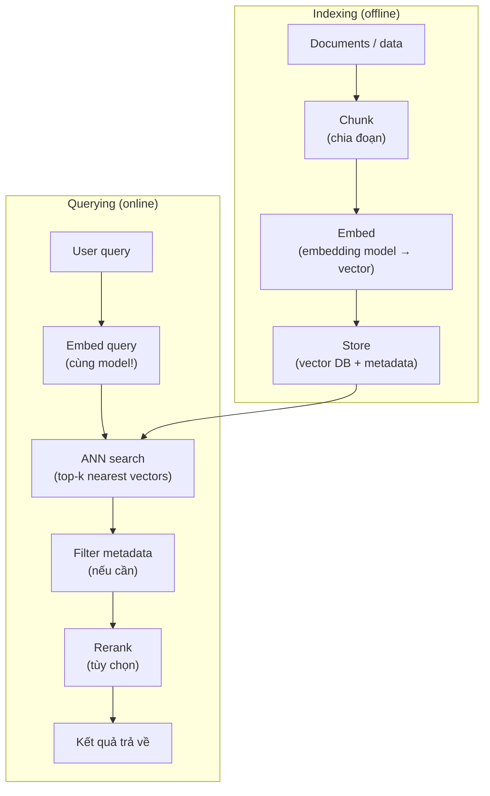
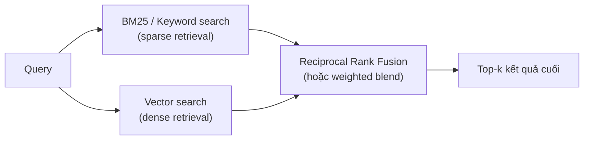
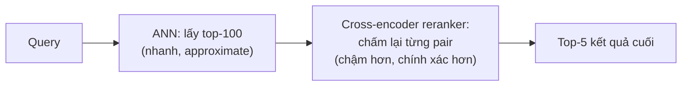
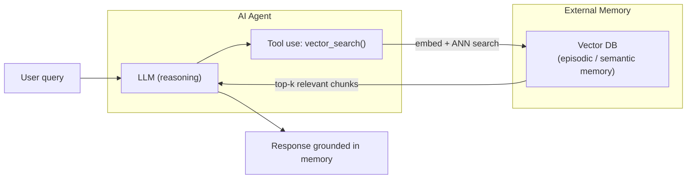

# Vector Search

Vector search là kỹ thuật **tìm kiếm theo nghĩa (semantic)** thay vì theo từ khoá: thay vì hỏi "câu này có chứa từ X không?", hỏi "câu này có ý nghĩa gần với query không?" — bằng cách so sánh khoảng cách giữa các vector trong không gian nhiều chiều (confidence: high).

> Prerequisite: hiểu embedding là gì, cách tính similarity (cosine, dot product, L2) và thuật toán ANN (HNSW, IVF) — xem [[llm-embedding]]. Note này tập trung vào pipeline engineering và production, không lặp lại phần nền tảng đó.

## Pipeline đầy đủ

Vector search gồm 2 giai đoạn tách biệt: **indexing** (offline, chạy một lần hoặc batch) và **querying** (online, realtime).



**Nguyên tắc quan trọng**: query và document **phải dùng cùng một embedding model** — vector từ model khác nhau không so sánh được (nằm trong không gian khác nhau) (confidence: high).

## Chunking — chia tài liệu trước khi embed

Embedding model có giới hạn token đầu vào (VD: OpenAI `text-embedding-3` tối đa 8,192 token). Với tài liệu dài, cần chia nhỏ trước khi embed — quyết định này ảnh hưởng lớn đến chất lượng retrieval (confidence: high).

| Chiến lược | Cách làm | Phù hợp | Rủi ro |
|---|---|---|---|
| Fixed-size | Chia theo N token, overlap M token giữa các đoạn | Simple, phổ biến nhất | Cắt giữa câu/ý → mất ngữ nghĩa |
| Sentence | Chia theo câu (dấu chấm/newline) | Text văn xuôi tự nhiên | Câu ngắn → ít context; câu dài → vượt limit |
| Semantic | Nhóm câu có cùng chủ đề (dùng embedding để detect ranh giới chủ đề) | Tài liệu dài, phức tạp | Phức tạp implement, chậm hơn |
| Document structure | Chia theo heading (Markdown, HTML) | Tài liệu có cấu trúc rõ | Phụ thuộc vào format input |

**Overlap** — giữ lại M token cuối của chunk trước ở đầu chunk tiếp theo, tránh mất thông tin ở ranh giới. Thường overlap 10–20% kích thước chunk (confidence: medium — con số cụ thể phụ thuộc domain/data).

> Note riêng `rag-chunking-strategies` sẽ cover chi tiết hơn khi vào phần RAG của [[ai-engineer-roadmap]].

## Gọi Embedding API — ví dụ với OpenAI

```python
from openai import OpenAI

client = OpenAI()

# Embed một đoạn text
response = client.embeddings.create(
    input="Con mèo đang nằm ngủ trên sofa.",
    model="text-embedding-3-small"  # 1536 chiều, rẻ hơn
    # model="text-embedding-3-large"  # 3072 chiều, chính xác hơn
)

vector = response.data[0].embedding  # list of floats, len = 1536
```

- **Giảm số chiều** — thêm `dimensions=256` để cắt xuống mà giữ gần đủ semantic (Matryoshka representation learning) — tiết kiệm storage và tốc độ tính similarity.
- **Batch embed** — truyền `input=["text1", "text2", ...]` thay vì gọi API từng cái — giảm latency và cost.
- **OpenAI đã normalize sẵn** — vector có độ dài = 1, nên cosine similarity = dot product — tính dot product nhanh hơn (confidence: high, OpenAI docs).

## Hybrid Search — kết hợp vector + keyword

Vector search một mình không phải lúc nào cũng tốt nhất — đặc biệt với query ngắn, tên riêng, số liệu chính xác. **Hybrid search** kết hợp 2 luồng tìm kiếm song song (confidence: high):



| | Keyword search (BM25) | Vector search | Hybrid |
|---|---|---|---|
| Tốt cho | Tên riêng, mã sản phẩm, từ khoá chính xác | Câu hỏi dạng tự nhiên, paraphrase, ngữ nghĩa | Cả hai |
| Thiếu sót | Không bắt được synonym/paraphrase | Nhớ fuzzy hơn keyword chính xác | Phức tạp hơn cả hai |
| Ví dụ | "iPhone 15 Pro Max giá bao nhiêu" → cần khớp "iPhone 15 Pro Max" | "điện thoại Apple cao cấp nhất" → cần semantic | Kết hợp cả hai |

**RRF (Reciprocal Rank Fusion)** — công thức đơn giản để trộn ranking từ 2 nguồn: `score = 1/(k + rank_keyword) + 1/(k + rank_vector)` với k thường = 60 (confidence: medium — RRF phổ biến nhưng nhiều vector DB dùng công thức riêng).

## Reranking — cải thiện precision sau ANN

ANN trả về top-k "gần nhất" — nhưng "gần trong không gian vector" không hoàn toàn bằng "liên quan nhất với query". Reranking là bước **chấm điểm lại** top-k đó bằng model phức tạp hơn (confidence: high):



- **ANN (bi-encoder)** — embed query và document riêng lẻ → dot product → nhanh, scale tốt, nhưng không xét tương tác giữa query và document.
- **Cross-encoder reranker** — nhận `[query, document]` cùng lúc → attend qua cả hai → điểm liên quan chính xác hơn nhiều, nhưng phải chạy N lần với N = số candidate.
- Thực tế: ANN lấy top-50~100, reranker chấm lại → lấy top-5~10 cuối — 2 bước này bổ trợ nhau về speed vs accuracy.

## Metadata filtering

Vector search thường đi kèm **filter theo metadata** — kết hợp semantic search với structured filter như SQL (confidence: high):

```python
# Pinecone-style: tìm vector gần nhất TRONG ĐÓ metadata phải match
results = index.query(
    vector=query_embedding,
    top_k=10,
    filter={
        "category": {"$eq": "technical"},
        "language": {"$in": ["vi", "en"]},
        "date": {"$gte": "2025-01-01"}
    }
)
```

**Pre-filter vs Post-filter:**
- **Pre-filter** — lọc metadata trước, chỉ ANN search trên tập đã lọc → chính xác hơn nhưng index phức tạp.
- **Post-filter** — ANN search trước, lọc metadata sau → có thể trả về ít hơn top-k nếu nhiều kết quả bị lọc bỏ.

## Vector databases phổ biến (2026)

| Database | Deployment | Điểm mạnh | Phù hợp cho |
|---|---|---|---|
| **Pinecone** | Managed cloud | Fully managed, dễ start, hybrid search built-in | Production nhanh, không muốn ops |
| **Qdrant** | Self-host / cloud | Open-source, Rust (nhanh), filtering mạnh | Control cao, self-host |
| **Weaviate** | Self-host / cloud | Schema-based, built-in reranker, GraphQL | Structured + unstructured kết hợp |
| **Chroma** | Self-host (local) | Siêu đơn giản, không cần server, Python-native | Prototype, local dev |
| **pgvector** | PostgreSQL extension | Tận dụng Postgres hiện có, SQL quen thuộc | Đã có Postgres, dataset vừa |
| **Milvus** | Self-host / cloud | Open-source, scale lớn, nhiều index type | Enterprise, billion-scale |

(as of 2026, confidence: medium — landscape vector DB thay đổi nhanh, cần verify pricing/feature trước khi chọn)

**Khi nào dùng cái nào:**
- **Prototype / local dev** → Chroma hoặc pgvector (cài vào Postgres hiện có).
- **Production managed** → Pinecone hoặc Qdrant Cloud.
- **Đã có PostgreSQL, dataset < vài triệu record** → pgvector (tránh thêm một service mới).
- **Scale lớn, tự host** → Milvus hoặc Qdrant.

## Vector search trong AI Agent

Vector search là thành phần cốt lõi của **agent memory và RAG** (confidence: high):



Hai vai trò chính:
1. **RAG** — lấy knowledge liên quan để grounding LLM answer, tránh hallucination về domain knowledge (xem nhóm `rag-` trong [[ai-engineer-roadmap]]).
2. **Agent memory** — agent lưu lại lịch sử hành động / observations vào vector DB, sau đó retrieve memory liên quan khi cần — cho phép agent "nhớ" qua nhiều session mà không cần nhét toàn bộ history vào context window.

## Trade-offs thực tế cần quyết định

| Quyết định | Options | Hướng dẫn |
|---|---|---|
| Embedding model | OpenAI (managed) vs self-host (BGE, E5) | Managed nếu cần nhanh, self-host nếu cần privacy/cost control |
| Số chiều | Giữ nguyên vs cắt (dimensions param) | Cắt xuống nếu storage/speed quan trọng, giảm < 50% thường an toàn |
| Chunk size | Nhỏ (128 token) vs lớn (512+ token) | Nhỏ → precision cao, ít context; Lớn → nhiều context, có thể noise |
| ANN algorithm | HNSW vs IVF | HNSW cho recall cao + RAM dư; IVF cho dataset lớn tiết kiệm memory |
| Reranking | Có vs không | Thêm nếu precision quan trọng hơn latency (thường thêm 50–200ms) |
| Hybrid | Vector only vs hybrid | Hybrid khi data có tên riêng/mã số/keyword chính xác quan trọng |

## Open questions / cần đọc thêm

- **Chunking strategy thực nghiệm** — fixed-size vs semantic chunking ảnh hưởng bao nhiêu đến recall thực tế trên dataset tiếng Việt? Cần tự benchmark.
- **Fine-tune embedding model** trên domain riêng (VD: code, tiếng Việt chuyên ngành) — chưa cover, để dành `finetune-embedding`.
- **Sparse + dense index kết hợp** trong cùng một vector DB (SPLADE + HNSW) — detail implementation chưa cover.
- **Evaluation của vector search** — đo recall@k, MRR, NDCG — cần note riêng khi build RAG pipeline thực tế.
- Liên hệ sâu hơn với RAG: vector search chỉ là bước retrieval — còn các bước generation, prompt construction, faithfulness evaluation — xem nhóm `rag-` trong [[ai-engineer-roadmap]].
